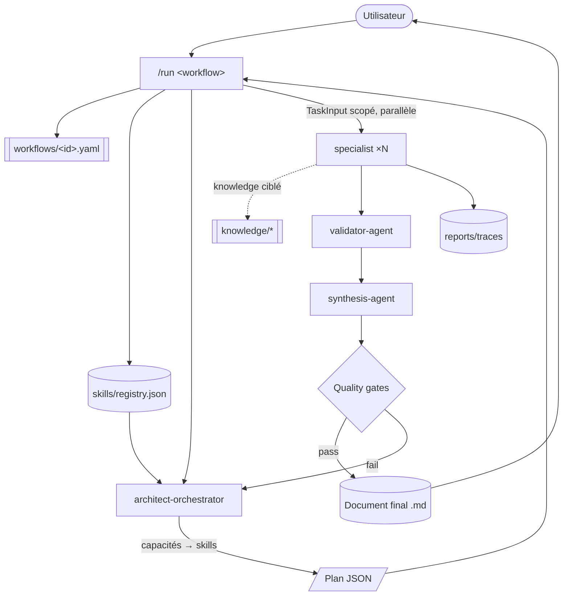

# dev-crew — plateforme multi-agent pour Claude Code

> **Une équipe de spécialistes logiciels IA, orchestrés par capacités.** L'orchestrateur
> ne connaît aucun nom de skill : il lit un **registre** et raisonne en **capacités**.
> Des experts isolés exécutent, un **validateur** contrôle, une **synthèse** fusionne.
> Conçue pour accueillir **des centaines de skills** sans refonte (OCP).

Version **2.0.0** · Voir la décision d'architecture complète :
[`docs/PHASE2-PLATFORM-ARCHITECTURE.md`](docs/PHASE2-PLATFORM-ARCHITECTURE.md).

## Principes

`SOLID` · `KISS` · `DRY` · `Open/Closed` · `Composition > héritage` ·
`Convention > configuration`. Chaque évolution = **ajout de fichiers**, jamais
modification du cœur. Détail du mapping : `docs/PHASE2-PLATFORM-ARCHITECTURE.md §2`.

## Deux plans d'exécution (ADR-001)

| Plan | Qui | Quoi |
|------|-----|------|
| **prompt-time** | agents (Markdown) | lisent des fichiers déclaratifs et agissent (jugement/expertise) |
| **tooling-time** | scripts `tools/*.mjs` (Node) | travail déterministe : index, scaffolding, docs, rapports |

## Pipeline



## Installation

Ce dépôt est sa propre marketplace. Depuis un terminal `claude` interactif :

```bash
/plugin marketplace add F:\Info\framework
```
```bash
/plugin install dev-crew@dev-crew-marketplace
```

Prérequis tooling : **Node ≥ 18** (testé Node 24) pour `tools/*.mjs`.

## Démarrage

```bash
# 1) (Ré)indexer skills + docs après tout changement
node tools/build-registry.mjs && node tools/gen-docs.mjs
# ou la commande :
/sync

# 2) Lancer un workflow de bout en bout
/run sds Plateforme SaaS de facturation multi-tenant avec portail client --lang both

# 3) Créer un nouveau skill (scaffolding conforme)
/new-skill operations/observability
```

## Concepts

- **Capacité** — unité de compétence (`react`, `jwt`, `openapi`). Les workflows et
  l'orchestrateur raisonnent en capacités, jamais en noms de skills (DIP).
- **Registre** (`skills/registry.json`, généré) — index `capacité → [skills]` + chemins.
- **Manifeste** (`skill.json`) — déclaration machine-lisible d'un skill (voir schéma).
- **Workflow** (`workflows/*.yaml`) — étapes déclaratives composant des capacités.
- **Knowledge pack** — docs d'un skill chargées **à la demande** (par capacité).
- **Quality gate** — seuil de score par dimension, contrôlé par le `validator-agent`.

## Structure

```
framework/
├── .claude-plugin/        plugin.json (v2) · marketplace.json
├── framework.config.json  version, budgets tokens, seuils gates, modèles
├── agents/                architect-orchestrator · specialist · validator-agent · synthesis-agent
├── skills/
│   ├── registry.json      (généré)
│   └── <category>/<skill>/  skill.json · SKILL.md · knowledge/ · examples/ · tests/ · README
├── workflows/             *.yaml (moteur déclaratif) + README
├── schemas/               skill · registry · workflow · trace · quality-report · api/*
├── tools/                 build-registry · validate · gen-docs · report · scaffold (+ lib/)
├── templates/             skill · workflow · agent · command · ADR
├── memory/ · cache/ · reports/   sous-systèmes runtime (git-ignorés)
├── commands/              run · sync · new-* · orchestrate · sds · <domaines>
├── docs/                  PHASE2-PLATFORM-ARCHITECTURE · INTERNAL-API · MIGRATION · …
│   └── generated/         inventaires + graphes (NE PAS ÉDITER)
└── README · LICENSE · CHANGELOG
```

## Catégories & skills

6 catégories : `engineering` · `design` · `operations` · `quality` · `documentation` ·
`ai`. **Migré (v2.0.0)** : `engineering` = architecture, frontend, backend, database, api
(manifestes + knowledge). Les autres restent en Phase 1 et se migrent sans toucher au
cœur — voir [`docs/MIGRATION.md`](docs/MIGRATION.md).

Inventaire à jour auto-généré : [`docs/generated/skills-inventory.md`](docs/generated/skills-inventory.md) ·
graphe des capacités : [`docs/generated/capability-graph.md`](docs/generated/capability-graph.md).

## Étendre

`/new-skill <category>/<slug>` scaffolde un skill conforme (manifeste + prompt + knowledge
+ tests) et reconstruit le registre. **Aucun agent n'est modifié.** Guide :
[`docs/ADDING-A-SKILL.md`](docs/ADDING-A-SKILL.md). Extensions tierces : ADR-016.

## Qualité & tooling

```bash
node tools/validate.mjs     # manifestes + registre à jour + workflows (DAG, capacités)
```
En CI, `validate.mjs` est bloquant. Stratégie de tests complète : ADR-019.

## Docs clés

[Architecture plateforme](docs/PHASE2-PLATFORM-ARCHITECTURE.md) ·
[API interne](docs/INTERNAL-API.md) · [Orchestration](docs/ORCHESTRATION.md) ·
[Contexte/tokens](docs/CONTEXT-MANAGEMENT.md) · [Conventions](docs/CONVENTIONS.md) ·
[Ajouter un skill](docs/ADDING-A-SKILL.md) · [Migration](docs/MIGRATION.md) ·
[Contribuer](docs/CONTRIBUTING.md).

## Licence

MIT — voir [`LICENSE`](LICENSE).
