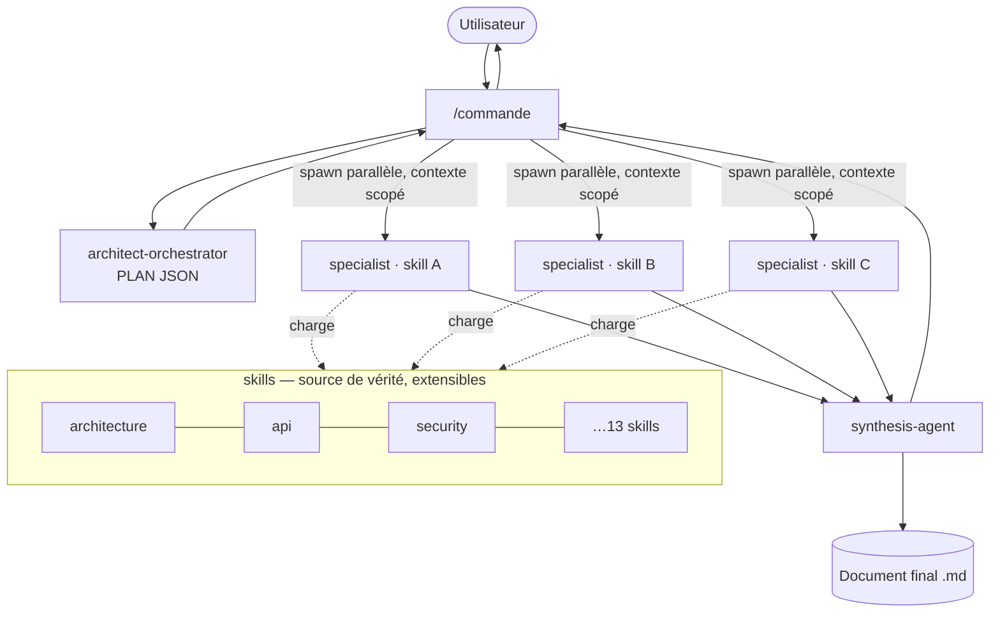

# Architecture du framework `dev-crew`

## 1. Principe

`dev-crew` transforme Claude Code en **équipe de spécialistes**. Un orchestrateur
route le travail, des experts isolés l'exécutent, un agent de synthèse fusionne. Aucune
logique métier n'est centralisée : elle vit dans des **skills** interchangeables.

## 2. Trois rôles, une responsabilité chacun

| Composant | Type | Rôle | Ne fait jamais |
|-----------|------|------|----------------|
| `architect-orchestrator` | agent | Découpe la demande, renvoie un PLAN JSON | Produire du contenu métier |
| `specialist` | agent | Exécute **un** skill sur un brief scopé, isolé | Sortir de son skill / lire le contexte global |
| `synthesis-agent` | agent | Fusionne, dédoublonne, arbitre, écrit le doc final | Inventer de l'expertise |
| `skills/<domaine>` | skill | Source de vérité de l'expertise d'un domaine | Empiéter sur un autre domaine |
| `commands/<nom>` | commande | Point d'entrée utilisateur, pilote le pipeline | Contenir de l'expertise |

## 3. Décision d'architecture clé : un `specialist` générique

**Alternative rejetée** : un agent par domaine (13 agents). **Retenu** : un seul agent
`specialist` paramétré par `SKILL`. Justification :

- **Évolutivité** — ajouter un domaine = ajouter un dossier `skills/<x>/`. Zéro nouvel
  agent, zéro modification de l'existant (principe ouvert/fermé).
- **Maintenabilité** — la mécanique d'exécution (charger un skill, scoper le contexte,
  produire le livrable) est écrite **une fois**.
- **Isolation** — chaque spawn de `specialist` a son propre contexte → tokens réduits,
  moins d'hallucinations, cohérence par domaine.

Voir [ADR intégré](#adr) ci-dessous.

## 4. Vue composants

## 5. Frontières & flux de dépendances

- Les **commandes** dépendent des **agents** (les spawnent) — jamais l'inverse.
- Le **specialist** dépend des **skills** (les charge) — les skills n'ont aucune
  dépendance sortante (feuilles réutilisables).
- L'**orchestrateur** ne connaît que la *liste* des skills (leurs noms + quand les
  choisir), pas leur contenu → couplage minimal.

## 6. Pourquoi cette isolation

| Objectif | Mécanisme |
|----------|-----------|
| Réduire les tokens | Contexte scopé par tâche, jamais l'historique complet |
| Limiter les hallucinations | Un expert = un domaine = un prompt court et net |
| Cohérence | `synthesis-agent` détecte et arbitre les conflits inter-domaines |
| Maintenance | Chaque skill évolue seul, versionné indépendamment |
| Évolutivité | Ajout de skills sans toucher agents/commandes existants |

## ADR

Voir `templates/ADR.template.md`. Décision fondatrice : **ADR-000 — Runner générique
`specialist` plutôt que N agents de domaine** (statut : Accepté). Conséquence : la
capacité du framework croît linéairement avec le nombre de skills, à coût de maintenance
quasi constant.
