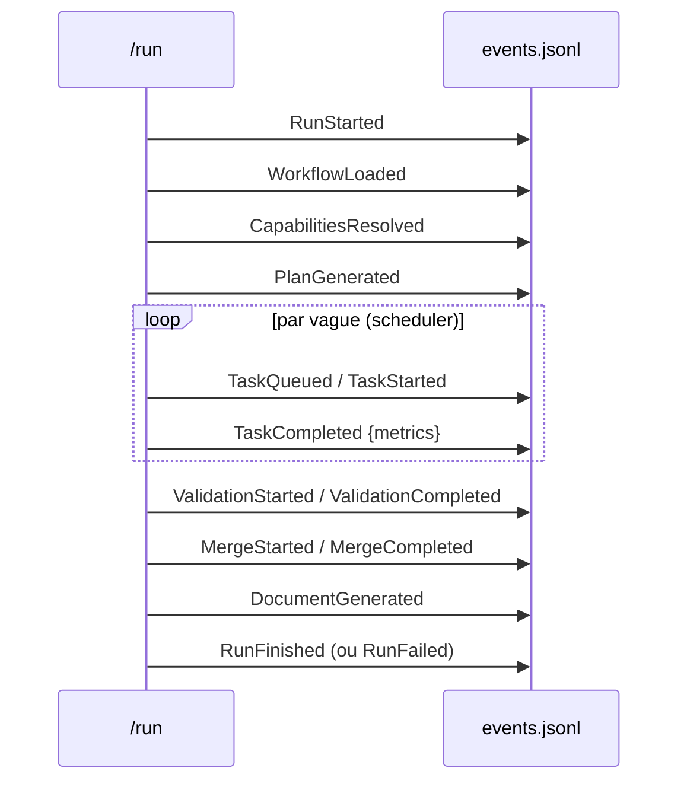

# Event Bus & Observability

Bus logique **append-only** (ADR-021) : `artifacts/runs/<runId>/events.jsonl`. Les
composants communiquent via événements ; aucun appel direct, aucun état partagé mutable.

## Enveloppe
`{ eventId, type, runId, seq, ts, payload }` — schéma
`schemas/events/event-envelope.schema.json`. `seq` monotone (ordre garanti par le
producteur). Payloads par type : `schemas/events/README.md`.

## Cycle de vie d'un run

## Observabilité (ADR-030)
`tools/observe.mjs <runId>` agrège l'`events.jsonl` en métriques
`{ events, byType, tokensIn/Out, estCostUsd, durationMs, cacheHit, knowledgeHit }` →
`artifacts/reports/<runId>-metrics.json`. Les métriques dérivent **uniquement** des
événements (source unique), et alimentent l'Architecture Score (ADR-035).
