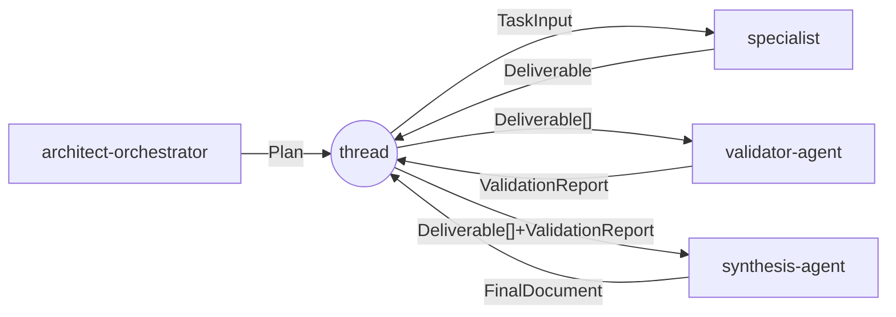

# API interne (contrats inter-composants) — v1

Interfaces stables et versionnées entre les composants du pipeline (ADR-015). Chaque
message porte `apiVersion: "1.0.0"`. Un changement incompatible ⇒ `v2` en parallèle,
avec fenêtre de dépréciation. Schémas normatifs sous `schemas/api/`.

## Messages

| Message | Producteur → Consommateur | Schéma |
|---------|---------------------------|--------|
| `Plan` | orchestrateur → thread | `schemas/api/plan.schema.json` |
| `TaskInput` | thread → specialist | `schemas/api/task-input.schema.json` |
| `Deliverable` | specialist → thread | `schemas/api/deliverable.schema.json` |
| `ValidationReport` | validator → thread | `schemas/api/validation-report.schema.json` |
| `FinalDocument` | synthèse → thread + fichier | `schemas/api/final-document.schema.json` |

### Plan
`{ apiVersion, objective, lang, outfile, tokenBudget, tasks[], synthesis }`. Chaque
`task` : `id, capabilities[], resolvedSkillId, brief, needs[], parallelGroup, files[],
produces`. **Les tâches référencent des capacités** ; `resolvedSkillId` est issu du
registre.

### TaskInput
`{ apiVersion, skillRef{ id, path, entry, version }, brief, lang, files[], prior[],
knowledgeRefs[], tokenBudget }`. `skillRef` provient de `skills/registry.json` (pas de
chemin en dur). `prior` = résumés `Hand-off` des dépendances (jamais les livrables
entiers).

### Deliverable
`{ apiVersion, domain, skillId, markdown, handoff, assumptions[], trace }`.

### ValidationReport
`{ apiVersion, scores{gate:0-100}, contradictions[], conventionIssues[], fixes[],
verdict }`. Sécurité sous seuil ⇒ `verdict: non-conforme` (bloquant).

### FinalDocument
`{ apiVersion, outfile, execSummary, conflicts[], assumptions[] }`.

## Règles de compatibilité
- Ajout de champ **optionnel** = mineur (rétrocompatible).
- Suppression/renommage/champ requis = **majeur** ⇒ `v2`.
- Les agents valident entrées/sorties contre ces schémas (tests de contrat, ADR-019).

## Substituabilité
Tout composant respectant ces contrats est remplaçable indépendamment (objectif final).
Exemple : un `validator-agent` alternatif est interchangeable s'il émet un
`ValidationReport` conforme.
