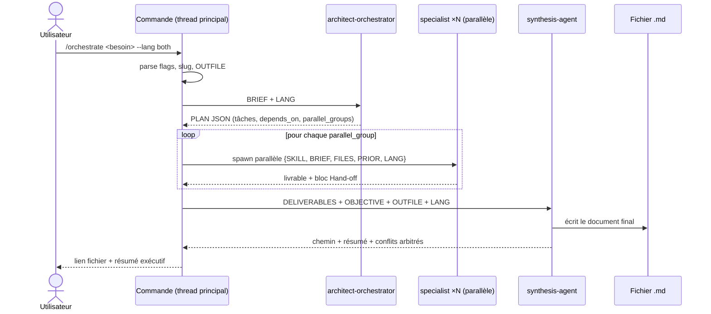

# Orchestration — comment les agents communiquent

## 1. Vue d'ensemble

```
Utilisateur → Commande → Orchestrateur → Sélection des skills
→ Exécution parallèle (specialists) → Synthèse → Réponse finale
```

Le **thread principal** (piloté par la commande) est le seul chef d'orchestre : lui seul
lance des sous-agents en parallèle. L'`architect-orchestrator` ne fait que **planifier**
(il ne spawne rien), ce qui respecte la limite « un sous-agent ne spawne pas d'autres
sous-agents ».

## 2. Diagramme de séquence



## 3. Contrat d'échange

### PLAN (orchestrateur → thread principal)
JSON strict : `objective`, `lang`, `outfile`, `tasks[]` (`id`, `skill`, `brief`,
`depends_on`, `files`), `parallel_groups[][]`, `synthesis`.

### Tâche (thread principal → specialist)
`SKILL`, `BRIEF` (auto-suffisant), `LANG`, `FILES` (chemins), `PRIOR` (résumés
`Hand-off` des dépendances). **Jamais** l'historique complet.

### Livrable (specialist → thread principal)
Markdown du domaine + bloc `## Hand-off` (décisions clés, contraintes pour les autres,
hypothèses `HYP-n`).

### Document final (synthesis → fichier + thread principal)
Fichier `.md` complet ; au thread : chemin + résumé exécutif + conflits arbitrés.

## 4. Gestion des dépendances et du parallélisme

- Les tâches d'un même `parallel_group` sont **indépendantes** → spawn simultané (un
  seul message, plusieurs appels `Agent`).
- Un groupe n'est lancé qu'après le précédent (les `depends_on` sont satisfaits).
- Seuls les **résumés Hand-off** des dépendances circulent (pas les livrables entiers)
  → propagation de contexte minimale.

## 5. Résolution de conflits

Détection par `synthesis-agent`. Ordre de priorité d'arbitrage :
**sécurité > correction fonctionnelle > performance > confort DX/UX**. Chaque arbitrage
est tracé dans la section « Cohérence inter-domaines » du document final.

## 6. Modes d'entrée

| Commande | Flux |
|----------|------|
| `/orchestrate`, `/sds` | Pipeline complet (orchestrateur → N specialists → synthèse) |
| `/architecture`, `/api`, … (mono-domaine) | Un seul `specialist`, pas de synthèse |
