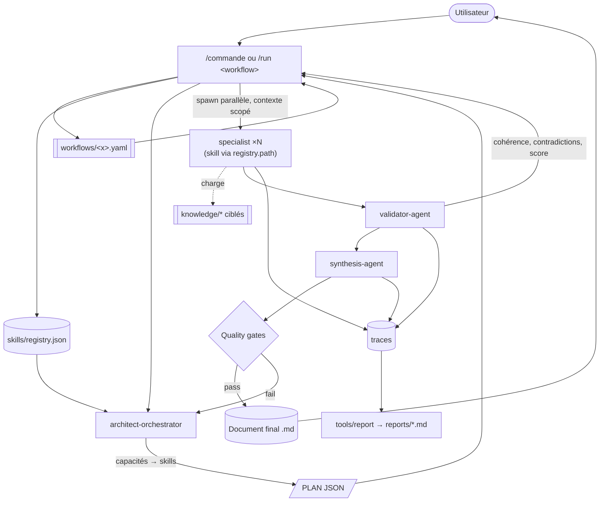

# dev-crew — Phase 2 : architecture de plateforme (SDS / ADR)

> **Statut : PROPOSÉ — en attente de validation.**
> Ce document décrit **toutes** les décisions structurantes de l'évolution du framework
> `dev-crew` d'une collection de skills vers une **plateforme d'orchestration d'experts
> IA** extensible à des centaines de skills. Aucun fichier d'implémentation Phase 2 n'est
> généré avant validation de ce document (§16 Validation logique interne, puis accord).

---

## 0. Sommaire

1. Objectif & portée
2. Principes directeurs (mapping concret)
3. **ADR-001 — Substrat d'exécution : prompt-time vs tooling-time** (décision fondatrice)
4. ADR-002 — Registre central & sélection par capacités
5. ADR-003 — Manifeste de skill (`skill.json`)
6. ADR-004 — Taxonomie par catégories
7. ADR-005 — Knowledge packs à chargement paresseux
8. ADR-006 — Moteur de workflows déclaratif (YAML)
9. ADR-007 — Découverte automatique
10. ADR-008 — Versionnement indépendant & compatibilité
11. ADR-009 — Pipeline d'exécution générique
12. ADR-010 — `validator-agent` & quality gates
13. ADR-011 — Mémoire
14. ADR-012 — Cache multi-niveaux & invalidation
15. ADR-013 — Token optimizer & budget
16. ADR-014 — Observabilité & traces
17. ADR-015 — API interne (contrats inter-composants)
18. ADR-016 — Extensions tierces (plugins)
19. ADR-017 — Générateurs (`/new-*`)
20. ADR-018 — Documentation auto-générée
21. ADR-019 — Stratégie de tests
22. Arborescence cible complète
23. Contrats de données (schémas)
24. Stratégie de migration Phase 1 → Phase 2
25. **Validation logique interne** (auto-contrôle)
26. Risques, hypothèses, questions ouvertes

---

## 1. Objectif & portée

**But.** Transformer `dev-crew` en plateforme où de nouveaux domaines d'expertise
s'ajoutent **par simple dépôt de fichiers**, sans modifier l'orchestrateur, les agents
ni les skills existants. Cible : centaines de skills, dizaines d'agents, N workflows,
maintenables dans la durée.

**Hors périmètre.** Réécriture du contenu métier des 13 skills existants (ils migrent
tels quels). Ce document ne code rien : il décide.

---

## 2. Principes directeurs (mapping concret)

| Principe | Application concrète dans dev-crew |
|----------|-----------------------------------|
| **SRP (SOLID)** | 1 skill = 1 domaine ; 1 agent = 1 rôle ; 1 tool = 1 fonction déterministe |
| **OCP (Open/Closed)** | Ajout de skill/workflow = nouveaux fichiers découverts ; zéro edit du cœur |
| **LSP** | Tout skill respecte le même **contrat de manifeste + I/O** → interchangeable |
| **ISP** | Contrats fins : `registry` expose des capacités, pas les manifestes entiers |
| **DIP** | Orchestrateur dépend d'**abstractions** (capacités) pas d'implémentations (noms) |
| **KISS** | Substrat = fichiers + prompts + scripts déterministes ; pas de runtime custom |
| **DRY** | Une source de vérité par info (manifeste), le reste la **référence** (registry généré) |
| **Composition > héritage** | Workflows **composent** des capacités ; pas d'héritage de skills |
| **Convention > configuration** | Emplacement/nommage standard ⇒ découverte sans config manuelle |

Ces principes sont les **critères d'acceptation** de chaque ADR ci-dessous.

---

## 3. ADR-001 — Substrat d'exécution : prompt-time vs tooling-time

**Contexte.** Un plugin Claude Code n'a pas de serveur ni de boucle d'exécution
persistante. Les « moteur de workflow », « découverte auto », « optimizer », « cache »,
« observabilité » risquent d'être des vœux pieux s'ils supposent un runtime.

**Décision.** Séparer explicitement deux plans d'exécution :

- **Prompt-time (interprétation par agents)** — l'orchestrateur, le specialist, le
  validator et la synthèse sont des prompts qui **lisent des fichiers déclaratifs**
  (`registry.json`, `skill.json`, `workflows/*.yaml`, `knowledge/*.md`) et agissent en
  conséquence. Aucun code métier compilé.
- **Tooling-time (scripts déterministes)** — dossier `tools/` : petits scripts **Node
  (ESM, zéro dépendance)** lancés à la demande via Bash/commande/hook :
  `build-registry`, `scaffold`, `gen-docs`, `report`, `validate-schemas`. Ils font le
  travail mécanique reproductible (indexation, génération, agrégation, lint de schéma).

**Règle de partage.** Tout ce qui est **déterministe et vérifiable** → tooling.
Tout ce qui demande **jugement/expertise** → prompt-time. Un composant n'est jamais à
moitié dans les deux.

**Conséquences.** (+) Chaque capacité « plateforme » devient réalisable et testable.
(+) Les scripts tournent en CI (déterministes). (−) Deux langages de raisonnement à
maintenir (JSON/YAML pour données, Markdown pour prompts) → mitigé par schémas + gabarits.

**Alternatives rejetées.** (a) Tout en prompt (orchestrateur « devine » les skills) →
non déterministe, coûteux, non testable. (b) Serveur MCP dédié → complexité et
dépendance d'infra contraires à KISS ; envisageable plus tard comme **adapter optionnel**
sans changer les contrats.

---

## 4. ADR-002 — Registre central & sélection par capacités

**Contexte.** L'orchestrateur ne doit jamais connaître les **noms** des skills.

**Décision.**
- Chaque skill porte un `skill.json` (ADR-003).
- Le tool `build-registry` scanne `skills/**/skill.json` et produit
  `skills/registry.json` : liste compacte + **index inversé de capacités**
  (`capability → [skillId]`).
- L'orchestrateur lit **uniquement** `registry.json`. Il raisonne en **capacités
  requises** (`react`, `jwt`, `openapi`…) → l'index renvoie les skills candidats →
  il sélectionne par `priority`, `maturityLevel`, `estimatedCost`, `recommendedModels`.

**Conséquences.** (+) DIP respecté : dépendance sur des capacités abstraites.
(+) Ajouter un skill n'exige aucun edit de l'orchestrateur. (−) `registry.json` doit
rester synchro → géré par ADR-007 (découverte).

**Alternatives rejetées.** Hard-coder la liste (Phase 1) → viole OCP. Laisser
l'orchestrateur globber les manifestes à chaque run → coûteux ; le registry est un cache
d'index (ADR-012).

---

## 5. ADR-003 — Manifeste de skill (`skill.json`)

**Contexte.** Chaque skill doit se **déclarer** de façon machine-lisible ; le specialist
ne doit dépendre d'aucun chemin fixe.

**Décision.** Un `skill.json` par skill, validé par un JSON Schema (`schemas/skill.schema.json`).
Champs (voir §23) : `id, name, version, author/owner, description, category, tags[],
capabilities[], dependencies[], priority, estimatedCost, qualityLevel, maturityLevel,
recommendedModels[], inputs, outputs (outputFormat), compatibleCommands[], compatibility
(ranges semver), knowledge[], examples[], documentation, entry (SKILL.md relatif)`.
Le specialist reçoit du registry le **`path` + `entry`** du skill retenu → aucun chemin
en dur.

**Conséquences.** (+) LSP/ISP : contrat uniforme, découplage. (+) Base des inventaires
et graphes auto-générés (ADR-018). (−) Discipline de remplissage → mitigée par
`/new-skill` (ADR-017) + validation de schéma en CI (ADR-019).

---

## 6. ADR-004 — Taxonomie par catégories

**Contexte.** Des centaines de skills → besoin d'organisation navigable.

**Décision.** Deux niveaux : `skills/<category>/<skill>/`. Catégories de 1er niveau
(stables, peu nombreuses — KISS) :

```
engineering/  design/  operations/  quality/  documentation/  ai/
```

Les « sous-domaines » listés (ui, ux, accessibility, monitoring, sds, adr, readme,
prompt, rag, memory, agents…) ne créent **pas** un skill chacun : ils sont exprimés
comme **capacités** et/ou **knowledge packs** d'un skill (évite l'explosion, DRY).
La granularité fine vit dans `capabilities[]`, pas dans l'arborescence.

Mapping des 13 skills existants :

| Catégorie | Skills |
|-----------|--------|
| engineering | architecture, frontend, backend, database, api |
| design | ui-ux *(capacités : ui, ux, accessibility, design-tokens)* |
| operations | security, devops *(monitoring = capacité de devops/perf)* |
| quality | review, testing, performance |
| documentation | documentation *(capacités : sds, adr, readme, api-docs)* |
| ai | ai *(capacités : prompt, rag, embeddings, memory, agents)* |

Chaque catégorie possède un `README.md` (généré/maintenu). Une catégorie n'est qu'un
regroupement : elle ne porte aucune logique.

**Conséquences.** (+) Navigation + inventaires par catégorie. (−) Choix de catégorie
d'un skill = métadonnée `category` (déplacer un skill = déplacer un dossier + rebuild).

**Alternative rejetée.** Un dossier par mot-clé du prompt utilisateur → des centaines de
micro-skills redondants, ingérables (viole KISS/DRY).

---

## 7. ADR-005 — Knowledge packs à chargement paresseux

**Décision.** Chaque skill peut fournir `knowledge/*.md`
(`react.md`, `nextjs.md`, `anti-patterns.md`, `best-practices.md`, `conventions.md`,
`examples.md`…), déclarés dans `skill.json > knowledge[]` avec `{file, capabilities,
tokensApprox}`. Le specialist charge **uniquement** les documents dont les capacités
correspondent à la tâche courante — jamais tout le pack.

**Conséquences.** (+) Contexte minimal, coût maîtrisé (aligné ADR-013). (+) Expertise
enrichissable sans toucher au prompt du skill. (−) Sélection à faire → règle simple :
intersection `task.capabilities ∩ knowledge.capabilities`.

---

## 8. ADR-006 — Moteur de workflows déclaratif (YAML)

**Contexte.** Les enchaînements (sds, audit, security-review, migration, bugfix,
refactor, api-design, plugin) ne doivent **pas** être codés dans les agents.

**Décision.** Dossier `workflows/*.yaml`, schéma `workflows/schema/workflow.schema.json`.
Un workflow décrit : `inputs`, `steps[]` (chaque step : `id`, `uses` = **capacités
requises** (pas un nom de skill), `with` = gabarit de brief, `needs` = dépendances,
`parallelGroup`, `when` = condition, `produces` = variable de sortie), `merge`
(config synthèse), `validation` (quality gates + seuils), `rollback`, `onError`.

Le **« moteur »** = le couple *commande générique `/run <workflow>`* (thread principal)
+ *orchestrateur* : la commande lit le YAML, l'orchestrateur résout capacités→skills via
le registry et produit le PLAN, le thread principal exécute (parallélisme = `parallelGroup`,
ordre = `needs`). **Aucune** logique de workflow dans les agents : ils interprètent des
données.

**Conséquences.** (+) OCP : nouveau workflow = nouveau fichier. (+) Composition pure.
(−) Besoin d'un lint de workflow (DAG acyclique, capacités existantes) → ADR-019.

**Alternative rejetée.** Un agent par workflow → duplication, non composable.

---

## 9. ADR-007 — Découverte automatique

**Décision.** Aucune édition manuelle pour enregistrer skill/workflow/template/agent.
Deux mécanismes complémentaires :

1. **Tooling (source de vérité de l'index)** — `tools/build-registry` (skills →
   `registry.json`) et `tools/gen-docs` (inventaires). Déclenchés par : la commande
   `/sync`, un hook `git` de pré-commit, ou au **début d'un run** si le registry est
   « périmé » (hash de `skills/**` ≠ `registry.json.sourceHash`).
2. **Fallback prompt-time** — si le tooling n'est pas exécutable, l'orchestrateur peut
   **globber** `skills/**/skill.json` directement (plus lent, mais jamais bloquant).

Convention > configuration : un skill est « découvert » dès qu'il est à
`skills/<cat>/<skill>/skill.json` conforme au schéma. Idem workflows (`workflows/*.yaml`),
templates (`templates/*`), agents (`agents/*.md`).

**Conséquences.** (+) Zéro couplage, zéro edit central. (−) Le registry peut diverger
→ résolu par le contrôle de fraîcheur (hash) et `/sync`.

---

## 10. ADR-008 — Versionnement indépendant & compatibilité

**Décision.** SemVer **par artefact** : framework, chaque agent, chaque skill, chaque
workflow, chaque template, chaque knowledge pack. Déclarations de compatibilité :

- `skill.json > compatibility.framework`: plage semver (`">=2.0.0 <3.0.0"`).
- `skill.json > dependencies[]`: `{capability, range}` (dépend de capacités versionnées,
  pas de skills nommés).
- `workflow.yaml > compatibility`: framework + capacités requises (ranges).
- `registry.json > schemaVersion`: version du **format** du registre.

Résolution : au run, l'orchestrateur écarte tout skill hors plage et le signale. Un
`framework.config.json` fixe la version courante du framework.

**Migration.** Stratégie **expand → migrate → contract** (voir §24) + fenêtres de
dépréciation (`maturityLevel: deprecated` avant suppression). Les changements de contrat
d'interface suivent l'**API interne versionnée** (ADR-015).

**Conséquences.** (+) Évolution sans casse. (−) Matrice de compat à surveiller →
`tools/validate-schemas` vérifie la cohérence des plages en CI.

---

## 11. ADR-009 — Pipeline d'exécution générique

**Décision.** Un pipeline unique, paramétré par un workflow :

```
Utilisateur → Commande → (charge Workflow) → Orchestrateur
→ Découverte des capacités (registry) → Sélection des experts
→ PLAN JSON → Specialists (parallèles, contexte scopé)
→ Validation (validator-agent) → Synthèse → Quality gates → Document final (+ traces)
```

Le **thread principal** (commande) reste le seul à spawner en parallèle. L'orchestrateur
**planifie** (ne spawne pas). Le validator s'intercale **avant** la synthèse ; les
quality gates s'appliquent **après** la synthèse (contrôle final). Diagramme : §fin.



**Conséquences.** (+) Un seul chemin d'exécution, réutilisé par tous les workflows.
(−) Boucle de reprise (gate fail → replanif) à borner (max itérations) pour éviter les
cycles coûteux.

---

## 12. ADR-010 — `validator-agent` & quality gates

**Décision.** Nouvel agent `validator-agent`, exécuté **avant** la synthèse.
Responsabilités : cohérence inter-livrables, détection de contradictions, respect des
conventions et des `FORMAT DE SORTIE`, attribution d'un **score par dimension**,
propositions de corrections. Il **n'écrit pas** le document final (rôle de la synthèse).

**Quality gates** = seuils déclarés dans le workflow (`validation.gates`) :

| Gate | Seuil défaut |
|------|--------------|
| architecture | ≥ 90 |
| api | ≥ 90 |
| security | ≥ 95 |
| performance | ≥ 85 |
| accessibility | ≥ 90 |
| testing | ≥ 85 |
| documentation | ≥ 90 |

Le validator produit un **quality-report** (schéma §23). Si un gate échoue : soit
replanification ciblée du domaine fautif (borne d'itérations), soit livraison marquée
`NON CONFORME` avec le rapport. La sécurité reste bloquante (jamais contournée).

**Conséquences.** (+) Qualité mesurable, portes objectives. (−) Étape LLM supplémentaire
→ modèle `sonnet` par défaut, `opus` si le run est critique.

---

## 13. ADR-011 — Mémoire

**Décision.** Dossier `memory/` à sous-espaces :
`conversation/`, `project/`, `workflow/`, `skills/`, `summaries/`. Politique : **préférer
résumés, contexte compressé et références** à l'historique brut. Écriture *write-through*
après chaque run (résumés + décisions + hypothèses ouvertes). Lecture : l'orchestrateur
charge `project/` + `summaries/` pertinents par **référence de chemin**, jamais le
contenu intégral. Les fichiers volumineux sont indexés par résumé.

**Conséquences.** (+) Continuité inter-sessions à faible coût. (−) Politique de rétention
et de purge à définir (taille max, TTL) → paramétrable dans `framework.config.json`.

---

## 14. ADR-012 — Cache multi-niveaux & invalidation

**Décision.** Niveaux et clés d'invalidation :

| Cache | Contenu | Clé / invalidation |
|-------|---------|--------------------|
| Prompt | Préfixes système stables (skills/agents) | Prompt caching LLM ; invalide au bump de version du prompt |
| Knowledge | Knowledge packs pré-résumés | hash du `.md` source |
| Workflow | PLAN résolu pour un workflow+inputs | hash(`workflow.yaml` + inputs + `registry.schemaVersion`) |
| Skill (registry) | Index de capacités | hash de `skills/**/skill.json` |
| Documents | Livrables de domaine réutilisables | hash(brief scopé + versions skills) |
| API | Réponses d'appels externes (si un tool en fait) | TTL + ETag |

Principe : **clé = hash de contenu + versions**. Un bump de version ou un changement de
source invalide. Les caches persistants vivent sous `cache/` (git-ignoré sauf descripteurs).

**Conséquences.** (+) Coût et latence réduits, réutilisation (ADR-013). (−) Risque de
stale → discipline stricte de clés par hash+version.

---

## 15. ADR-013 — Token optimizer & budget

**Décision.** Composant transverse = **politique (prompt-time)** + **tool (tooling-time)**.

- **Budget** configurable dans `framework.config.json` : `tokenBudget.perRun`,
  `perStep`, `perSkill`, seuils d'alerte. Le workflow peut surcharger.
- **Fonctions** : compression, résumé, suppression du bruit, fusion de contextes
  redondants, **référencement** (passer un chemin plutôt que le contenu), priorisation
  (charger d'abord ce qui a le meilleur ratio valeur/token).
- **Réalisation** : (a) `tools/optimize` pré-résume les knowledge packs volumineux
  (déterministe, mis en cache) ; (b) chaque agent reçoit son `tokenBudget` dans le brief
  et applique les règles de §CONTEXT-MANAGEMENT ; (c) l'orchestrateur refuse un plan
  dont le coût estimé (somme `estimatedCost`) dépasse le budget et propose une réduction
  de périmètre.

**Conséquences.** (+) Coût plafonné et prévisible. (−) Sur-compression = perte
d'information → garde-fou : ne jamais compresser une contrainte de sécurité/spec dure.

---

## 16. ADR-014 — Observabilité & traces

**Décision.** Chaque étape émet une **trace** (schéma §23) : `stepId, workflow, skillId,
capabilities, model, startedAt, durationMs, tokensIn, tokensOut, estCostUsd, status,
warnings[], errors[]`. Les traces d'un run sont regroupées sous `reports/traces/<runId>/`.
`tools/report` agrège en `reports/<runId>.md` : durée totale, tokens, coût, taux de
succès, gates, warnings. Le run porte un `runId` (horodaté). Les agents émettent les
champs qu'ils connaissent ; le tooling calcule les agrégats.

**Conséquences.** (+) Coûts et perfs mesurables, base d'optimisation. (−) Les tokens
réels ne sont pas toujours exposés à l'agent → estimations calibrées + valeurs exactes
récupérées du log de session par le tool quand disponibles.

---

## 17. ADR-015 — API interne (contrats inter-composants)

**Contexte.** Orchestrateur → Specialist → Validator → Synthèse doivent être remplaçables
indépendamment ⇒ contrats stables et versionnés.

**Décision.** Définir une **API interne v1** = ensemble de schémas de messages
(`schemas/api/*.schema.json`), documentée dans `docs/INTERNAL-API.md` :

- `Plan` (orchestrateur → thread) : objectif, lang, budget, `tasks[]`
  (`id, capabilities[], brief, needs[], parallelGroup, files[], produces`), `synthesis`.
- `TaskInput` (thread → specialist) : `skillRef {id, path, entry, version}`, `brief`,
  `lang`, `files[]`, `prior[]` (résumés Hand-off), `knowledgeRefs[]`, `tokenBudget`.
- `Deliverable` (specialist → thread) : `domain`, `markdown`, `handoff`, `assumptions[]`,
  `trace`.
- `ValidationReport` (validator → thread) : `scores{gate:0-100}`, `contradictions[]`,
  `conventionIssues[]`, `fixes[]`, `verdict`.
- `FinalDocument` (synthèse → fichier + thread) : `outfile`, `execSummary`, `conflicts[]`,
  `assumptions[]`.

Chaque message porte `apiVersion`. Changement incompatible ⇒ `v2` en parallèle (fenêtre
de dépréciation). Les agents valident leurs entrées/sorties contre ces schémas.

**Conséquences.** (+) Substituabilité totale des composants (objectif final). (−) Rigueur
de conformité → tests de contrat (ADR-019).

---

## 18. ADR-016 — Extensions tierces (plugins)

**Décision.** Un tiers ajoute **skills / workflows / templates / knowledge / commands**
sans modifier le framework, via **deux voies** :

1. **Marketplace Claude Code** — chaque extension est son propre plugin ; ses skills
   déclarent leurs `capabilities`. Au chargement, `build-registry` **fusionne** tous les
   `skill.json` visibles (cœur + extensions) dans le registry → l'orchestrateur les
   sélectionne par capacité, sans savoir qu'ils sont « tiers ».
2. **Dossier `extensions/` local** (convention) — même mécanisme de découverte.

Contrat d'extension = **exactement** les schémas ADR-003/006/015. Aucune API privilégiée.
Résolution de collision de capacités : par `priority` puis `maturityLevel` (documenté).

**Conséquences.** (+) Écosystème ouvert, cœur figé. (−) Confiance/qualité des tiers →
`maturityLevel` + quality gates + audit `/review` recommandés avant adoption.

---

## 19. ADR-017 — Générateurs (`/new-*`)

**Décision.** Scaffolding déterministe via `tools/scaffold` + commandes minces :
`/new-skill`, `/new-workflow`, `/new-agent`, `/new-command`, `/new-template`.
`/new-skill <cat>/<nom>` crée : dossier, `skill.json` (pré-rempli, valide), `SKILL.md`
(gabarit 8 sections), `knowledge/` (stubs), `examples/`, `tests/`, `README.md`, puis
**rebuild du registry**. Idem pour les autres. Le générateur applique les conventions
(nommage, structure) → « Convention > configuration » garanti mécaniquement.

**Conséquences.** (+) Onboarding d'un nouveau domaine en une commande, conforme par
construction. (−) Gabarits à maintenir alignés avec les schémas → un seul endroit
(`templates/`), référencé par le scaffolder.

---

## 20. ADR-018 — Documentation auto-générée

**Décision.** `tools/gen-docs` produit à partir du registry + workflows + manifestes :
`docs/generated/` → inventaire des skills, inventaire des workflows, **graphe de
dépendances** (Mermaid), **graphe des capacités** (capacité → skills), rapport qualité
consolidé, et README de catégories. Ces fichiers sont **générés** (bandeau « NE PAS
ÉDITER »). La doc « écrite à la main » (ADR, guides) reste séparée sous `docs/`.

**Conséquences.** (+) Doc toujours synchro, à coût nul. (−) Séparer clairement
généré/manuel (dossier `generated/`).

---

## 21. ADR-019 — Stratégie de tests

**Décision.** Pyramide adaptée à un framework « données + prompts + scripts » :

| Niveau | Cible | Outil / nature | CI |
|--------|-------|----------------|----|
| Schéma | `skill.json`, `workflow.yaml`, messages API | JSON Schema (déterministe) | ✅ bloquant |
| Structure | `SKILL.md` a ses 8 sections ; `Hand-off` présent | script lint | ✅ |
| Découverte | registry se construit ; pas de capacité orpheline | `build-registry --check` | ✅ |
| Workflow | DAG acyclique ; capacités référencées existent | `validate` lint | ✅ |
| Contrat (API) | messages conformes aux schémas | fixtures + validation | ✅ |
| Migration | anciens artefacts chargent sous nouveau schéma | fixtures versionnées | ✅ |
| Perf/coût | budget respecté sur workflows types | `report` sur runs golden | ⚠️ seuil |
| Éval agents | qualité de sortie (LLM-as-judge = validator) | golden prompts | ⚙️ optionnel/non bloquant |
| Non-régression | golden outputs comparés (structure, gates) | diff structurel | ⚠️ |

Les niveaux déterministes tournent en CI (GitHub Actions). L'éval LLM est optionnelle
(coût). Dossier `tests/`.

**Conséquences.** (+) Confiance sans dépendre de la variabilité LLM pour l'essentiel.
(−) L'éval qualité reste indicative.

---

## 22. Arborescence cible complète

```
framework/
├── .claude-plugin/
│   ├── plugin.json                 # + version framework
│   └── marketplace.json
├── framework.config.json           # version, budgets tokens, rétention mémoire, seuils
├── commands/
│   ├── orchestrate.md · sds.md · review.md · … (existants, adaptés capacités)
│   ├── run.md                      # /run <workflow> — moteur générique
│   ├── sync.md                     # rebuild registry + docs générés
│   └── new-skill.md · new-workflow.md · new-agent.md · new-command.md · new-template.md
├── agents/
│   ├── architect-orchestrator.md   # sélection PAR CAPACITÉS (lit registry)
│   ├── specialist.md               # skill résolu via registry (path/entry), knowledge ciblé
│   ├── validator-agent.md          # NOUVEAU
│   ├── synthesis-agent.md
│   └── README.md
├── skills/
│   ├── registry.json               # GÉNÉRÉ (index + capabilityIndex)
│   ├── README.md
│   └── <category>/<skill>/
│         ├── skill.json            # manifeste
│         ├── SKILL.md              # prompt (8 sections)
│         ├── knowledge/*.md        # packs lazy
│         ├── examples/*
│         ├── tests/*
│         └── README.md
├── workflows/
│   ├── schema/workflow.schema.json
│   ├── sds.yaml · audit.yaml · security-review.yaml · plugin.yaml · migration.yaml
│   ├── api-design.yaml · bugfix.yaml · refactor.yaml
│   └── README.md
├── schemas/
│   ├── skill.schema.json · registry.schema.json
│   ├── trace.schema.json · quality-report.schema.json
│   └── api/plan.schema.json · task-input.schema.json · deliverable.schema.json
│         · validation-report.schema.json · final-document.schema.json
├── templates/
│   ├── skill/ · workflow/ · agent/ · command/ · knowledge/ · adr/
│   └── README.md
├── tools/
│   ├── build-registry.mjs · scaffold.mjs · gen-docs.mjs · report.mjs · validate.mjs
│   └── README.md
├── memory/
│   ├── conversation/ · project/ · workflow/ · skills/ · summaries/
│   └── README.md
├── cache/                          # descripteurs versionnés ; artefacts git-ignorés
│   └── README.md
├── reports/                        # traces + rapports générés (git-ignorés)
│   └── README.md
├── tests/                          # suites (schéma, discovery, workflow, contrat, migration)
├── docs/
│   ├── PHASE2-PLATFORM-ARCHITECTURE.md   # CE DOCUMENT
│   ├── INTERNAL-API.md · MIGRATION.md · CONVENTIONS.md · CONTEXT-MANAGEMENT.md
│   ├── ORCHESTRATION.md · ADDING-A-SKILL.md · CONTRIBUTING.md · ARCHITECTURE.md
│   └── generated/                  # inventaires + graphes (NE PAS ÉDITER)
├── README.md · LICENSE · CHANGELOG.md
```

---

## 23. Contrats de données (extraits normatifs)

### 23.1 `skill.json`
```json
{
  "$schema": "../../../schemas/skill.schema.json",
  "id": "engineering.frontend",
  "name": "Frontend",
  "version": "1.0.0",
  "owner": { "name": "cmm07t83", "email": "cmm07t83@gmail.com" },
  "description": "Expert React/Next/TS/Tailwind.",
  "category": "engineering",
  "tags": ["react", "nextjs", "typescript"],
  "capabilities": ["react", "nextjs", "typescript", "tailwind", "ui-components", "seo-fe"],
  "dependencies": [{ "capability": "design-tokens", "range": ">=1.0.0 <2.0.0" }],
  "priority": 50,
  "estimatedCost": { "unit": "tokens", "typical": 6000 },
  "qualityLevel": "stable",
  "maturityLevel": "stable",
  "recommendedModels": ["claude-sonnet-5", "claude-opus-4-8"],
  "inputs": ["brief", "files", "prior", "designTokens?"],
  "outputs": { "outputFormat": "markdown", "sections": ["Arborescence", "Rendu", "…", "Hand-off"] },
  "compatibleCommands": ["frontend", "sds", "orchestrate"],
  "compatibility": { "framework": ">=2.0.0 <3.0.0" },
  "knowledge": [
    { "file": "knowledge/react.md", "capabilities": ["react"], "tokensApprox": 1200 },
    { "file": "knowledge/nextjs.md", "capabilities": ["nextjs"], "tokensApprox": 1500 }
  ],
  "examples": ["examples/dashboard.md"],
  "documentation": "README.md",
  "entry": "SKILL.md"
}
```

### 23.2 `registry.json` (généré)
```json
{
  "schemaVersion": "1.0.0",
  "framework": "2.0.0",
  "generatedAt": "2026-07-25T00:00:00Z",
  "sourceHash": "sha256:…",
  "skills": [
    { "id": "engineering.frontend", "version": "1.0.0", "category": "engineering",
      "path": "skills/engineering/frontend", "entry": "SKILL.md",
      "capabilities": ["react","nextjs","typescript","tailwind","ui-components"],
      "priority": 50, "maturityLevel": "stable", "estimatedCost": 6000,
      "recommendedModels": ["claude-sonnet-5"], "compatibleCommands": ["frontend","sds"] }
  ],
  "capabilityIndex": {
    "react": ["engineering.frontend"],
    "jwt": ["operations.security"],
    "openapi": ["engineering.api"]
  }
}
```

### 23.3 `workflow.yaml`
```yaml
id: sds
version: 1.0.0
description: Software Design Specification complète.
compatibility: { framework: ">=2.0.0 <3.0.0" }
inputs: [brief, lang]
tokenBudget: { perRun: 120000 }
steps:
  - id: arch
    uses: [architecture-style, adr, diagrams]      # capacités, pas de nom de skill
    with: { brief: "Architecture cible pour: {{brief}}" }
    parallelGroup: 1
    produces: arch
  - id: data
    uses: [postgres-schema, indexing, migrations]
    needs: [arch]
    parallelGroup: 2
    produces: data
merge: { agent: synthesis-agent, outfile: "./SDS-{{slug}}.md" }
validation:
  agent: validator-agent
  gates: { architecture: 90, security: 95, documentation: 90 }
  maxReplan: 1
rollback: { onGateFail: replan-domain, else: mark-nonconforme }
onError: { strategy: abort-and-report }
```

### 23.4 `trace` & `quality-report` (formes)
```json
// trace
{ "runId":"2026-07-25T00-00Z-ab12", "stepId":"arch", "skillId":"engineering.architecture",
  "model":"claude-sonnet-5", "durationMs":8200, "tokensIn":3100, "tokensOut":1800,
  "estCostUsd":0.04, "status":"ok", "warnings":[], "errors":[] }
```
```json
// quality-report
{ "runId":"…", "overall":93,
  "gates":{"architecture":95,"security":92,"documentation":100},
  "pass":true, "contradictions":[], "fixes":[] }
```

---

## 24. Stratégie de migration Phase 1 → Phase 2

**Compatibilité ascendante visée** : les 13 skills actuels continuent de fonctionner
pendant la migration.

1. **Expand** (non cassant) — ajouter, sans rien retirer : `schemas/`, `tools/`,
   `workflows/`, `memory/`, `framework.config.json`, `validator-agent`, `registry.json`.
   Générer un `skill.json` pour chaque skill existant via `tools/scaffold --from-existing`.
2. **Move** — déplacer `skills/<skill>/` → `skills/<category>/<skill>/`. `build-registry`
   réindexe ; les commandes passent de `SKILL=<nom>` à **résolution par capacités** (le
   nom reste accepté comme alias transitoire via `capabilityIndex`).
3. **Migrate** — orchestrateur : retirer la liste codée en dur, lire `registry.json`.
   Specialist : résoudre `path/entry` via registry (fin des chemins fixes).
4. **Contract** — supprimer les alias de noms et le fallback hard-codé une fois les
   workflows/tests verts. Bump framework `2.0.0`.

**Fenêtres de dépréciation** : tout retrait passe d'abord par `maturityLevel: deprecated`
(≥ 1 version mineure) avant suppression. `docs/MIGRATION.md` détaillera chaque étape +
rollback (revenir au registry précédent, artefacts versionnés).

**Rétrocompat des interfaces** : `apiVersion` sur chaque message ; introduction de `v2`
en parallèle de `v1` avant retrait de `v1`.

---

## 25. Validation logique interne (auto-contrôle)

### 25.1 Conformité aux exigences Phase 2
| Exigence | Couvert par | Vérifié |
|----------|-------------|---------|
| Registre central, orchestrateur sans noms | ADR-002, §23.2 | ✅ orchestrateur lit `capabilityIndex` |
| Sélection par capacités | ADR-002/006 | ✅ workflows `uses: [capacités]` |
| Manifeste par skill, pas de chemin fixe | ADR-003, §23.1 | ✅ specialist reçoit `path/entry` du registry |
| Moteur de workflows externalisé | ADR-006 | ✅ YAML + interprétation, zéro logique en agent |
| Découverte auto | ADR-007 | ✅ scan + fallback glob, hash de fraîcheur |
| Catégories + README | ADR-004, §22 | ✅ 6 catégories, README par catégorie |
| Knowledge packs lazy | ADR-005 | ✅ intersection de capacités |
| Versionnement indépendant + migration | ADR-008/§24 | ✅ SemVer/artefact, expand→contract |
| Pipeline générique + Mermaid | ADR-009 | ✅ diagramme fourni |
| validator-agent + quality gates | ADR-010 | ✅ avant synthèse / seuils après |
| Mémoire | ADR-011 | ✅ sous-espaces, résumés/refs |
| Cache multi-niveaux + invalidation | ADR-012 | ✅ clés hash+version |
| Token optimizer + budget configurable | ADR-013 | ✅ config + refus de plan hors budget |
| Observabilité/traces/rapports | ADR-014 | ✅ schéma trace + report |
| Plugins tiers sans modif du cœur | ADR-016 | ✅ fusion de manifestes par découverte |
| API interne documentée | ADR-015 | ✅ schémas + INTERNAL-API.md |
| Tests (unit→migration→régression) | ADR-019 | ✅ pyramide déterministe + éval opt. |
| Générateurs /new-* | ADR-017 | ✅ scaffolder + commandes |
| Doc auto-générée | ADR-018 | ✅ gen-docs → docs/generated |
| Composants remplaçables indépendamment | ADR-015/008 | ✅ contrats versionnés |

### 25.2 Cohérence des principes
- **OCP** — seuls des *ajouts* de fichiers sont requis pour étendre ; le seul point
  historiquement « central » (liste de skills) est **supprimé** au profit du registry
  généré. ✅
- **DIP** — dépendances dirigées vers des **capacités** (abstraction), jamais des noms. ✅
- **DRY** — une source de vérité (manifeste) ; registry, docs, graphes sont **dérivés**. ✅
- **KISS** — pas de runtime ; fichiers + prompts + petits scripts sans dépendance. ✅
- **Composition** — workflows composent des capacités ; aucun héritage. ✅

### 25.3 Invariants à ne jamais violer (contrôlés en CI)
1. Aucun agent ne référence un **nom** de skill en dur (grep interdit en test).
2. Tout `skill.json`/`workflow.yaml` valide son schéma.
3. Graphe de workflow **acyclique** ; toute capacité `uses` existe dans le registry.
4. Sécurité : un quality gate sécurité échoué **bloque** (non contournable).
5. Un message inter-composant porte un `apiVersion` conforme.

### 25.4 Points de fragilité identifiés (et parade)
- **Divergence registry ↔ manifestes** → hash de fraîcheur + `/sync` + fallback glob.
- **Boucle gate-fail ↔ replan** → borne `maxReplan` dans le workflow.
- **Tokens réels non exposés** → estimations calibrées + lecture du log de session par
  `tools/report` quand possible.
- **Collision de capacités entre tiers** → résolution `priority`→`maturityLevel`, tracée.

**Conclusion d'auto-validation** : les exigences sont toutes couvertes, les principes
tenus, les invariants testables. Le design est jugé **logiquement cohérent et prêt à
implémenter**, sous réserve des décisions ouvertes ci-dessous.

---

## 26. Risques, hypothèses, questions ouvertes

**Hypothèses (à confirmer).**
- `HYP-1` — Node est disponible pour exécuter `tools/*.mjs` (sinon : fournir un doublon
  PowerShell, ou fallback prompt-time only).
- `HYP-2` — La distribution vise la marketplace Claude Code (fusion de manifestes tiers
  via découverte, pas via un registre réseau).
- `HYP-3` — L'éval qualité LLM reste optionnelle (coût) ; les gates bloquants s'appuient
  sur des vérifications structurelles + le validator, pas sur un jugement subjectif.

**Questions ouvertes (décision requise avant code).**
- `Q1` — **Langage du tooling** : Node ESM seul, ou Node + doublon PowerShell (Windows) ?
- `Q2` — **Ampleur de l'implémentation à générer maintenant** : (a) squelette de
  plateforme complet mais avec **1 catégorie migrée** (engineering) en preuve ; (b)
  migration **des 13 skills** d'emblée ; (c) squelette + registry + 1 workflow (`sds`)
  bout-en-bout comme vertical slice.
- `Q3` — **Nom/version** : bump framework à `2.0.0` et renommer en `dev-crew` (déjà) —
  confirmer, ou versionner `1.x` tant que Phase 2 est incrémentale ?
- `Q4` — **Cache/reports/memory** : committés (descripteurs) vs entièrement git-ignorés ?

**Risques.** Complexité perçue (mitigée par générateurs + conventions) ; coût des runs
multi-agents (mitigé par budget + cache + routage de modèles) ; qualité des extensions
tierces (mitigée par maturity + gates + audit).

---

*Fin du document — en attente de validation logique et d'accord avant génération du code.*
