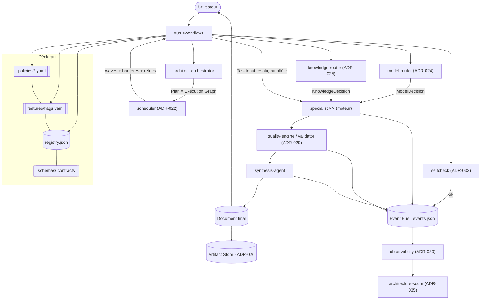

# dev-crew — Phase 3 : plateforme d'orchestration industrielle (SDS / ADR)

> **Statut : PROPOSÉ — en attente de validation.** Aucun fichier d'implémentation Phase 3
> n'est généré avant validation (§ Validation interne, puis accord).
>
> **Contrainte absolue : ne jamais casser l'API v1.** Toute évolution des contrats est
> **additive** (champs optionnels) ⇒ reste `v1`. Un changement incompatible crée
> `schemas/api/v2/` sans retirer `v1`.
>
> **Pas de nouvelle fonctionnalité utilisateur.** Objectif = industrialiser : réduire le
> couplage, augmenter l'extensibilité, améliorer la maintenabilité, à l'échelle de
> centaines de skills / workflows / plugins.

---

## 0. Sommaire
1. Objectif & principe directeur V3
2. Vue d'ensemble (pipeline industriel)
3. ADR-020 — Policy Engine
4. ADR-021 — Event Bus (logique, append-only)
5. ADR-022 — Scheduler
6. ADR-023 — Execution Graph
7. ADR-024 — Model Router
8. ADR-025 — Knowledge Router
9. ADR-026 — Artifact Store
10. ADR-027 — Contract Engine
11. ADR-028 — Plugin SDK
12. ADR-029 — Quality Engine
13. ADR-030 — Observability
14. ADR-031 — Feature Flags
15. ADR-032 — Dependency Graph
16. ADR-033 — Self Validation (preflight)
17. ADR-034 — Extension System
18. ADR-035 — Architecture Score
19. Contrats & schémas (v1 gelé, deltas additifs, nouveaux schémas)
20. Arborescence cible V3
21. Conventions (deltas)
22. Migration Phase 2 → V3
23. Validation interne (auto-contrôle)
24. Risques, hypothèses, questions ouvertes

---

## 1. Objectif & principe directeur V3

Le comportement quitte les prompts. Il est piloté par **7 sources déclaratives**
(manifests, policies, workflows, registry, contracts, capabilities, schemas) et exécuté
par des **résolveurs déterministes**. Les agents deviennent de purs **moteurs
d'exécution** : ils reçoivent des entrées **déjà résolues** (modèle choisi, knowledge
sélectionné, ordre planifié) et produisent une **sortie contractuelle**.

**Loi de placement (raffine ADR-001).**
| Nature | Plan | Exemples |
|--------|------|----------|
| Constantes / règles | **déclaratif** (`policies/`, `features/`, `contracts`) | budgets, seuils, ordre de résolution, flags |
| Décision déterministe | **tooling** (`tools/*.mjs`) | scheduler, model-router, knowledge-router, self-check, scores |
| Jugement / rédaction | **prompt** (agents) | produire un livrable, arbitrer une synthèse |

Conséquence directe : **aucune valeur numérique, id de modèle, seuil ou ordre n'apparaît
dans un prompt d'agent.** (Invariant contrôlé, §23.)

---

## 2. Vue d'ensemble — pipeline industriel



Chaque flèche « décision » (scheduler, model, knowledge) est **déterministe** et pilotée
par policies. Chaque transition émet un **événement** (ADR-021). Chaque échange est
**validé par un contrat** (ADR-027).

---

## 3. ADR-020 — Policy Engine

**Contexte.** Des constantes (budgets, modèles, seuils, retries) sont dispersées dans
`framework.config.json` et risquent de refluer dans les prompts.

**Décision.** Dossier `policies/` (déclaratif) : `routing.yaml`, `quality.yaml`,
`security.yaml`, `memory.yaml`, `execution.yaml`, `models.yaml`, `budgets.yaml`.
Un résolveur `tools/policy.mjs` calcule la **valeur effective** d'une clé selon une
**précédence** stricte :
```
defaults (schema) < policies/*.yaml < workflow.overrides < run.overrides
```
`framework.config.json` devient un **shim** rétrocompatible (pointe vers policies ;
valeurs dupliquées dépréciées). Aucun agent ni tool ne contient de littéral de config ;
tous appellent `policy.get('budgets.perRun')`.

**Contenu (exemples).** budget max, modèle préféré, ordre de résolution des capacités,
qualité minimale, score de validation, nombre max de specialists, timeouts, retries,
priorités.

**Conséquences.** (+) Source unique et versionnée des constantes (DRY, maintenabilité).
(+) Réglage sans toucher au code/prompt. (−) Précédence à documenter et tester.

**Alternatives rejetées.** Garder `framework.config.json` monolithique → couplage,
granularité insuffisante par domaine.

---

## 4. ADR-021 — Event Bus (logique, append-only)

**Contexte.** Les composants doivent communiquer sans se connaître (couplage minimal),
mais un plugin Claude Code n'a pas de runtime pub/sub.

**Décision.** Bus **logique append-only** : `artifacts/runs/<runId>/events.jsonl`.
Chaque événement = enveloppe validée `{ eventId, type, runId, seq, ts, payload }`
(schéma `schemas/events/<Event>.schema.json`). Producteurs (commande, tools, agents)
**append** ; consommateurs (observability, self-heal, scores) **lisent**. Aucun état
partagé mutable, pas de daemon (KISS).

**Événements (14).** `RunStarted, WorkflowLoaded, CapabilitiesResolved, PlanGenerated,
TaskQueued, TaskStarted, TaskCompleted, ValidationStarted, ValidationCompleted,
MergeStarted, MergeCompleted, DocumentGenerated, RunFinished, RunFailed`.

**Conséquences.** (+) Découplage total (composants ↔ événements), traçabilité, rejouabilité.
(+) Base de l'observabilité et des scores. (−) Ordre garanti par `seq` monotone (le
producteur incrémente) — à respecter.

**Alternatives rejetées.** Appels directs entre composants → couplage ; bus mémoire →
impossible sans runtime.

---

## 5. ADR-022 — Scheduler

**Contexte.** La planification des dépendances/parallélisme vivait dans l'orchestrateur.

**Décision.** `tools/scheduler.mjs` (déterministe) reçoit l'**Execution Graph** (ADR-023)
et produit un **plan d'exécution** : ordre topologique, **vagues** parallèles, barrières,
`timeout`/`retry` par tâche (issus de `policies/execution.yaml`), limite de parallélisme
(`maxSpecialists`). L'orchestrateur **ne planifie plus** : il déclare seulement les
tâches et leurs `dependencies`. `/run` exécute selon le schedule.

**Sortie (`Schedule`).** `waves: [[taskId…]]`, `barriers`, `retryPolicy`, `timeouts`.

**Conséquences.** (+) Séparation nette planification métier (capacités) / ordonnancement
(exécution). (+) Parallélisme et retries réglés par policy. (−) Nouveau composant à tester
(DAG, cycles, famine).

**Alternatives rejetées.** Laisser l'orchestrateur ordonner → mélange de responsabilités
(viole SRP), ordonnancement non réglable.

---

## 6. ADR-023 — Execution Graph

**Contexte.** Le `Plan` doit exprimer un graphe exploitable par le scheduler.

**Décision.** La tâche du `Plan` gagne des champs **optionnels additifs** (⇒ reste v1) :
`dependencies` (alias explicite de `needs`, tous deux acceptés), `priority`,
`estimatedCost`, `estimatedTokens`, `estimatedDuration`, `qualityTarget`,
`requiredKnowledge`. `parallelGroup` devient **déprécié** (toléré) : le scheduler dérive
le parallélisme du DAG. Le scheduler construit le DAG à partir de `dependencies`.

**Conséquences.** (+) Ordonnancement riche (coût, durée, priorité, qualité cible).
(+) 100 % rétrocompatible (champs optionnels, `needs` conservé). (−) Deux clés
équivalentes (`needs`/`dependencies`) le temps de la dépréciation.

---

## 7. ADR-024 — Model Router

**Contexte.** Le choix du modèle ne doit jamais être codé dans un agent.

**Décision.** `tools/model-router.mjs` lit `policies/models.yaml` + signaux de tâche
(`complexity`, `budget`, `latency`, `qualityTarget`, `history`) et renvoie une
**`ModelDecision`** `{ model, temperature, reasoning, maxTokens }` (schéma dédié).
Le `TaskInput` transporte la décision ; l'agent l'**applique**, ne la choisit pas.
Table de routage déclarative (ex. extraction→Haiku, synthèse critique→Opus).

**Conséquences.** (+) Politique de coût/qualité centralisée et testable. (+) Agents
agnostiques du modèle. (−) Estimateur de complexité à calibrer (heuristique déclarative
dans `models.yaml`).

---

## 8. ADR-025 — Knowledge Router

**Contexte.** Le `specialist` lisait `knowledge/` lui-même (logique dans le prompt).

**Décision.** `tools/knowledge-router.mjs` décide des documents utiles à partir de :
`capabilities` de la tâche, `workflow`, `tags`, `priorité`, `version`, `score qualité`,
règles de `policies/routing.yaml`. Il renvoie une **`KnowledgeDecision`** `{ docs:[…] }`.
Le `specialist` reçoit `knowledgeRefs` **déjà résolus** et ne charge **que** ceux-là. Il
ne scanne plus `knowledge/`.

**Conséquences.** (+) Sélection déterministe, réglable, mesurable (knowledge hit).
(+) Agent purement exécutant. (−) Router à tenir synchro avec les manifestes (déjà
couvert par le registry).

---

## 9. ADR-026 — Artifact Store

**Contexte.** Les composants travaillaient sur des fichiers arbitraires (couplage chemin).

**Décision.** `artifacts/{runs,plans,reports,validation,documents}/`. Tout artefact est
enveloppé de métadonnées `{ id, version, hash, date, workflow, origin }` (schéma
`artifact.schema.json`). `tools/artifacts.mjs` expose `put/get/list` ; les composants
référencent un **artifactId**, jamais un chemin brut. Contenu volumineux adressé par
`hash` (dédup, cache).

**Conséquences.** (+) Traçabilité, versionnage, rejouabilité, cache par hash.
(+) Découplage des chemins. (−) Indirection (id → chemin) à gérer par le store.

---

## 10. ADR-027 — Contract Engine

**Contexte.** Interdire tout objet libre entre composants.

**Décision.** `tools/contract.mjs` : `validate(payload, contractId)` contre `schemas/`.
La chaîne `Plan → Task → Deliverable → Validation → Merge → FinalDocument` est
**intégralement schématisée** ; un payload non conforme est **rejeté** (émet `RunFailed`).
`apiVersion` obligatoire. **v1 gelé** : seuls des champs optionnels s'ajoutent ; tout
breaking ⇒ `schemas/api/v2/` (coexistence). Un mini-validateur JSON Schema (sous-ensemble
maison, zéro dépendance) applique required/type/enum/pattern/const.

**Conséquences.** (+) Substituabilité garantie, erreurs tôt. (−) Discipline de conformité
(tests de contrat, ADR-019).

---

## 11. ADR-028 — Plugin SDK

**Contexte.** Un tiers doit créer un plugin **sans connaître le cœur**.

**Décision.** `sdk/{templates,examples,documentation}` + `tools/sdk.mjs init <plugin>`.
Le SDK génère un plugin externe complet : `manifest` (plugin.json), `schemas` (copie des
contrats publics), `tests`, `README`, `knowledge`, un skill d'exemple. Il n'expose que
les **contrats publics** (schemas/api + skill.schema + workflow.schema) et la loi de
découverte (ADR-034). Aucune dépendance au code interne.

**Conséquences.** (+) Écosystème, onboarding tiers en une commande. (−) Surface publique à
maintenir stable (versionnée avec l'API v1).

---

## 12. ADR-029 — Quality Engine

**Contexte.** Étendre la validation en évaluation qualité multi-dimensions.

**Décision.** Le `validator-agent` devient l'interface du **Quality Engine**, piloté par
`policies/quality.yaml` (dimensions, poids, seuils). Dimensions (10) : Architecture,
Performance, Documentation, Sécurité, Tests, UX, API, Maintenabilité, Lisibilité, Dette
technique. Chaque note = `{ score, explanation, evidence[], recommendations[] }`. Sortie =
**`QualityReport`** (schéma **nouveau**, sur-ensemble additif de `ValidationReport` — v1
reste émis/valide via projection). Sécurité bloquante (policy `security.yaml`).

**Conséquences.** (+) Qualité explicable et pilotable par policy. (−) Coût d'évaluation →
dimensions activables par feature flag (ADR-031) ; preuves obligatoires (anti-arbitraire).

---

## 13. ADR-030 — Observability

**Décision.** `tools/observe.mjs` agrège l'`events.jsonl` + traces d'un run en **métriques**
`{ time, tokens, cost, latency, model, cacheHit, knowledgeHit, workflow, quality }`,
exportables (`md`/`json`) sous `artifacts/reports/`. Alimente les scores (ADR-035).
Chaque métrique dérive d'événements (source unique).

**Conséquences.** (+) Mesure de bout en bout, exportable, base d'optimisation. (−) Tokens
réels parfois estimés (calibrés depuis le log de session quand disponibles).

---

## 14. ADR-031 — Feature Flags

**Décision.** `features/flags.yaml` (déclaratif) : `validator, knowledge, parallel, memory,
reports, quality, router, scheduler` (+ dimensions qualité). Les moteurs **lisent le flag**
et activent/sautent une étape. **Aucun `if` dans un prompt** : le prompt reçoit une entrée
déjà conditionnée par la commande/tooling selon les flags. Précédence via Policy Engine
(run > workflow > features > defaults).

**Conséquences.** (+) Activation/désactivation sans code, expérimentation, dégradation
gracieuse. (−) Combinatoire à borner (tests de matrices de flags clés).

---

## 15. ADR-032 — Dependency Graph

**Décision.** `tools/depgraph.mjs` scanne plugins, skills, knowledge, workflows, agents,
policies, schemas et produit un **graphe** (JSON + Mermaid) dans `docs/generated/`.
Détecte cycles, orphelins, capacités non fournies, versions incompatibles.

**Conséquences.** (+) Vue systémique auto, détection de couplage. (−) Scan à maintenir avec
les nouveaux types d'artefacts.

---

## 16. ADR-033 — Self Validation (preflight)

**Décision.** `tools/selfcheck.mjs` (généralise `validate.mjs`) s'exécute **avant chaque
run** et vérifie : registry, policies, schemas, workflows, knowledge (refs), compatibilité,
versions, capabilities. **Aucune exécution si une incohérence est détectée** (`/run`
s'arrête, émet `RunFailed`). Toujours actif (non désactivable par flag).

**Conséquences.** (+) Sécurité d'exécution, échec tôt et lisible. (−) Léger surcoût au
démarrage (négligeable, déterministe).

---

## 17. ADR-034 — Extension System

**Décision.** Formalise la découverte des extensions tierces apportant skills, knowledge,
templates, workflows, commands **et policies**, sans modifier le dépôt principal. Sources :
plugins de la marketplace + `extensions/` local. `build-registry` fusionne les manifestes ;
`policy.mjs` fusionne les policies d'extension (précédence < policies cœur pour la sécurité).
Résolution de collision : `priority` puis `maturityLevel` (déjà défini). Une extension ne
peut **pas** relâcher une policy de sécurité du cœur (garde-fou).

**Conséquences.** (+) Écosystème ouvert, cœur figé (OCP). (−) Confiance des tiers →
`maturityLevel`, quality gates, sandbox de policies sécurité.

---

## 18. ADR-035 — Architecture Score

**Décision.** `tools/score.mjs` calcule des **scores globaux expliqués** :
`Architecture, Quality, Complexity, Maintainability, Risk, Extensibility, Documentation`.
Entrées : métriques (ADR-030), structure (couplage via depgraph, nb de skills, couverture
de schémas, couverture de tests/docs), résultats qualité. Chaque score = `{ value,
explanation, evidence[], recommendations[] }`. Sortie = artefact + `docs/generated/architecture-score.md`.

**Conséquences.** (+) Pilotage de la santé du framework dans le temps. (−) Formules à
calibrer et documenter (déclarées dans `policies/quality.yaml`).

---

## 19. Contrats & schémas (v1 gelé, deltas additifs, nouveaux)

### 19.1 Gelé — inchangé (v1)
`schemas/api/{plan,task-input,deliverable,validation-report,final-document}.schema.json`
restent valides. `schemas/{skill,registry,workflow,trace,quality-report,framework-config}`
inchangés.

### 19.2 Deltas additifs (restent v1 — champs optionnels)
- `plan` : `tasks[]` + `dependencies?, priority?, estimatedCost?, estimatedTokens?,
  estimatedDuration?, qualityTarget?, requiredKnowledge?`.
- `task-input` : `+ modelDecisionRef?, knowledgeDecisionRef?, scheduleRef?, artifactRefs?`.
- `deliverable` : `+ qualityHints?, artifactId?`.

### 19.3 Nouveaux schémas (n'affectent pas v1)
```
schemas/
  policy/{routing,quality,security,memory,execution,models,budgets}.schema.json
  events/<Event>.schema.json         # 14 + enveloppe event-envelope.schema.json
  api/model-decision.schema.json
  api/knowledge-decision.schema.json
  api/schedule.schema.json
  api/quality-report.schema.json      # sur-ensemble additif de validation-report
  artifact.schema.json
  features.schema.json
  architecture-score.schema.json
  dependency-graph.schema.json
```

### 19.4 Enveloppe d'événement (extrait)
```json
{ "eventId":"…","type":"TaskCompleted","runId":"…","seq":42,"ts":"…",
  "payload":{ "taskId":"api","skillId":"engineering.api","status":"ok" } }
```

### 19.5 ModelDecision / KnowledgeDecision (extraits)
```json
{ "apiVersion":"1.0.0","taskId":"arch","model":"claude-opus-4-8",
  "temperature":0.2,"reasoning":"high","maxTokens":8000,
  "rationale":"qualityTarget=95, budget ok" }
```
```json
{ "apiVersion":"1.0.0","taskId":"frontend","docs":["skills/engineering/frontend/knowledge/react.md"],
  "rationale":"capabilities∩{react}; nextjs non requis" }
```

**Règle de compatibilité (rappel).** Ajout optionnel = mineur (v1). Retrait/renommage/
required = **v2** dans `schemas/api/v2/`, `v1` conservé jusqu'à fin de dépréciation.

---

## 20. Arborescence cible V3 (ajouts sur Phase 2)

```
framework/
├── policies/                 routing · quality · security · memory · execution · models · budgets (.yaml) + README
├── features/                 flags.yaml + README
├── contracts/                README (pointe vers schemas/ ; « contract engine »)
├── artifacts/                runs/ · plans/ · reports/ · validation/ · documents/ (git-ignoré) + README
│   └── runs/<runId>/events.jsonl
├── sdk/                      templates/ · examples/ · documentation/ + README
├── extensions/               (découverte tierce locale) + README
├── schemas/
│   ├── policy/*.schema.json
│   ├── events/*.schema.json
│   └── api/{model-decision,knowledge-decision,schedule,quality-report}.schema.json  (+ v2/ si besoin)
├── tools/                    + policy · scheduler · model-router · knowledge-router · artifacts
│                             · contract · observe · depgraph · selfcheck · score · sdk (.mjs)
├── agents/                   inchangés en rôle, allégés (reçoivent décisions résolues)
├── docs/                     + PHASE3-INDUSTRIAL-ARCHITECTURE · POLICIES · EVENTS · SCORING
│   └── generated/            + architecture-score.md · dependency-graph.md (enrichi)
└── framework.config.json     → shim rétrocompat vers policies/
```

---

## 21. Conventions (deltas)

- **Zéro constante dans un prompt** : budgets, modèles, seuils, ordres, retries → `policies/`.
  Lint : `selfcheck` signale tout littéral numérique/`claude-*` dans `agents/*.md`.
- **Zéro objet libre** : tout payload inter-composant porte `apiVersion` et passe
  `contract.validate`.
- **Événements append-only**, `seq` monotone, jamais de mutation rétroactive.
- **Adressage par artifactId/hash**, pas de chemin brut entre composants.
- **Flags déclaratifs** : une étape optionnelle se pilote par `features/flags.yaml`, pas
  par un `if` de prompt.
- **v1 gelé** : PR modifiant un schéma `api/*` v1 de façon non-additive = refusée par CI.

---

## 22. Migration Phase 2 → V3 (100 % additive, v1 gelé)

`expand` uniquement — rien n'est retiré :
1. Ajouter `policies/`, `features/`, `artifacts/`, `sdk/`, `extensions/`, nouveaux `schemas/`.
2. **Déplacer les constantes** de `framework.config.json` → `policies/*` ; laisser un
   **shim** lisant les policies (rétrocompat).
3. Ajouter les tools (`policy, scheduler, model-router, knowledge-router, artifacts,
   contract, observe, depgraph, selfcheck, score, sdk`).
4. **Alléger les agents** : retirer tout résidu de constante/choix ; ils reçoivent
   `ModelDecision`/`KnowledgeDecision`/`Schedule` déjà résolus. Contrats **inchangés**
   (les décisions arrivent via champs optionnels du `TaskInput`).
5. `/run` insère : `selfcheck` (preflight) → événements → scheduler → routers → quality →
   observe → score. Étapes gardées par feature flags (défaut : parité fonctionnelle avec
   Phase 2).
6. Dépréciations douces : `parallelGroup` toléré, `needs`≡`dependencies`. Aucun breaking.

Rollback : supprimer les dossiers ajoutés + réactiver les valeurs du shim ; le pipeline
Phase 2 refonctionne à l'identique (aucune dépendance dure introduite dans les contrats).

---

## 23. Validation interne (auto-contrôle)

### 23.1 Couverture des exigences (ADR-020 → 035)
| ADR | Exigence | Réalisation | v1-safe |
|-----|----------|-------------|---------|
| 020 | Toutes constantes hors agents | `policies/` + `policy.mjs` + précédence | ✅ (config→shim) |
| 021 | Communication par événements + schémas | `events.jsonl` + `schemas/events/*` | ✅ (nouveau) |
| 022 | Scheduler décide ordre/parallélisme/retries | `tools/scheduler.mjs` + `execution.yaml` | ✅ |
| 023 | PLAN = graphe orienté enrichi | champs optionnels additifs sur `plan` | ✅ additif |
| 024 | Choix modèle hors agents | `model-router.mjs` + `models.yaml` → `ModelDecision` | ✅ (champ optionnel) |
| 025 | Specialist ne lit plus knowledge/ | `knowledge-router.mjs` → `KnowledgeDecision` | ✅ (champ optionnel) |
| 026 | Artefacts versionnés/hachés | `artifacts/` + `artifacts.mjs` + `artifact.schema` | ✅ |
| 027 | Contrats obligatoires, pas d'objet libre | `contract.mjs` sur toute la chaîne | ✅ (v1 gelé) |
| 028 | SDK plugin tiers sans cœur | `sdk/` + `sdk.mjs init` | ✅ |
| 029 | Qualité 10 dimensions expliquées | `quality.yaml` + `QualityReport` (sur-ensemble) | ✅ (v1 projeté) |
| 030 | Métriques exportables | `observe.mjs` depuis événements | ✅ |
| 031 | Feature flags, pas d'`if` en prompt | `features/flags.yaml` lu par moteurs | ✅ |
| 032 | Graphe de dépendances auto | `depgraph.mjs` → Mermaid+JSON | ✅ |
| 033 | Self-validation bloquante avant run | `selfcheck.mjs` preflight | ✅ |
| 034 | Extensions tierces auto-découvertes | découverte + fusion registry/policies | ✅ |
| 035 | Scores globaux expliqués | `score.mjs` → artefact + doc | ✅ |

### 23.2 Compatibilité API v1 (preuve)
- Aucun schéma `api/*` v1 n'est modifié de façon non-additive (§19.1).
- Les décisions (model/knowledge/schedule) transitent par des **champs optionnels** du
  `TaskInput` ou des artefacts référencés → un consommateur v1 les ignore sans erreur.
- `QualityReport` est un **nouveau** schéma ; `ValidationReport` v1 reste émis par
  projection (sécurité + scores essentiels).
- CI : test « no-breaking-v1 » compare les schémas `api/*` v1 à un snapshot figé.

### 23.3 Principes
- **Couplage ↓** : composants ↔ événements + contrats (aucun appel direct). 
- **Extensibilité ↑** : policies, flags, extensions, SDK — tout par ajout de fichiers (OCP).
- **Maintenabilité ↑** : constantes centralisées (DRY), agents minimaux (SRP), décisions
  déterministes testables.
- **KISS** : bus = fichier append-only ; moteurs = petits scripts ; pas de runtime.

### 23.4 Invariants (contrôlés par `selfcheck` / CI)
1. Aucun littéral de constante ni id de modèle dans `agents/*.md`.
2. Tout payload inter-composant valide son contrat (`apiVersion` présent).
3. Aucun run si `selfcheck` échoue.
4. Schémas `api/*` v1 identiques au snapshot (pas de breaking).
5. Une policy d'extension ne peut pas relâcher une policy `security` du cœur.

**Conclusion.** Exigences 020–035 couvertes, principes tenus, v1 prouvé intact,
invariants testables. Design jugé **cohérent et prêt à implémenter** sous réserve des
décisions ouvertes (§24).

---

## 24. Risques, hypothèses, questions ouvertes

**Hypothèses.** `HYP-1` Node disponible (déjà vrai). `HYP-2` distribution marketplace +
`extensions/` local. `HYP-3` évaluation qualité partiellement LLM (validator) avec preuves
obligatoires ; scores structurels (couplage, couverture) 100 % déterministes.

**Risques.** Sur-ingénierie perçue (mitigée : feature flags → activation progressive,
défaut = parité Phase 2) ; combinatoire de flags (tests de matrices clés) ; calibration des
formules de score (déclarées et versionnées dans `policies/quality.yaml`).

**Questions ouvertes (décision avant code).**
- `Q1` — **Périmètre du slice V3** à implémenter après validation (voir choix proposé).
- `Q2` — **Placement model/knowledge routers** : tooling déterministe (recommandé, aligne
  « agents = moteurs ») vs résolution prompt-time lisant les policies.
- `Q3` — **Event bus** : `events.jsonl` par run (recommandé) vs un fichier par événement.
- `Q4` — **framework.config.json** : shim rétrocompat (recommandé) vs suppression immédiate
  (casserait la commodité, pas l'API).

*Fin du document — en attente de validation interne et d'accord avant génération du code.*
