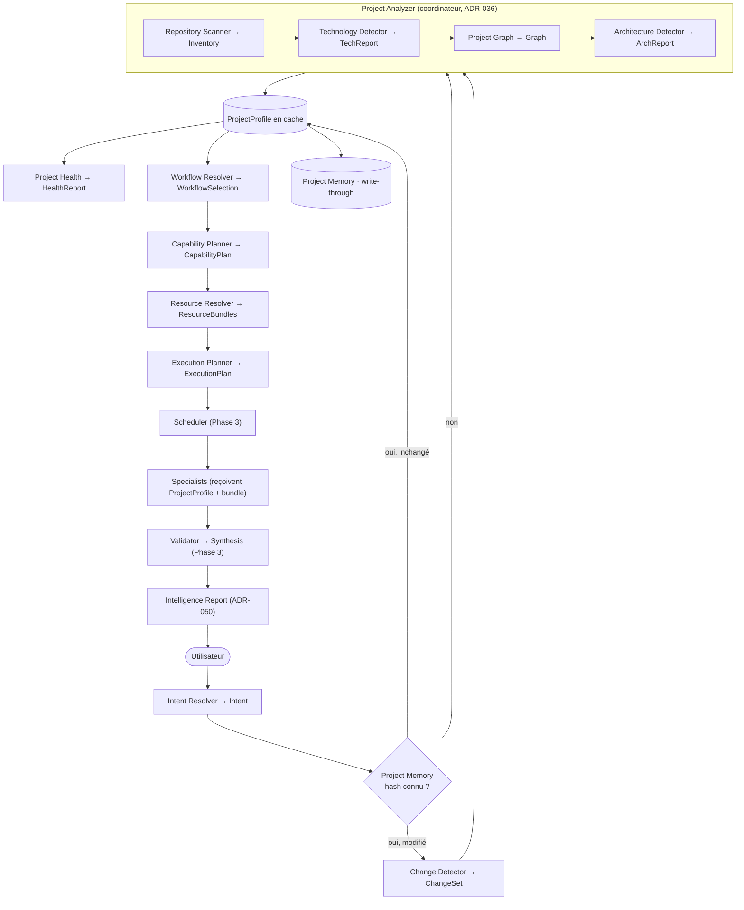

# dev-crew — Phase 4 : Project Intelligence Platform (SDS / ADR)

> **Statut : PROPOSÉ — en attente de validation.** Aucun fichier d'implémentation Phase 4
> avant validation (§ Auto-validation, puis accord).
>
> **Contraintes.** Contrats existants **jamais cassés** ; toute évolution **additive**.
> Tous les composants **déterministes** et **reproductibles** ; aucune logique métier dans
> les prompts ; tous les moteurs échangent via **contrats JSON versionnés** ; **analyse sans
> IA quand possible**, l'IA n'intervient que pour le jugement.

---

## 0. Sommaire
1. Objectif & principe directeur
2. Pipeline cible (Project Intelligence en tête)
3. ADR-036 — Project Analyzer (coordinateur)
4. ADR-037 — Repository Scanner
5. ADR-038 — Technology Detector (signatures déclaratives)
6. ADR-039 — Project Graph
7. ADR-040 — Project Profile (contrat, versionné)
8. ADR-041 — Capability Planner
9. ADR-042 — Workflow Resolver
10. ADR-043 — Resource Resolver
11. ADR-044 — Project Memory
12. ADR-045 — Change Detector (analyse incrémentale)
13. ADR-046 — Execution Planner
14. ADR-047 — Semantic Knowledge Index
15. ADR-048 — Architecture Detector
16. ADR-049 — Project Health
17. ADR-050 — Intelligence Report
18. Placement : déterministe vs IA
19. Contrats & schémas (nouveaux, additifs ; v1 gelé)
20. Arborescence cible
21. Conventions (deltas)
22. Migration Phase 3 → 4 & stratégie de compatibilité
23. Auto-validation (preuves de cohérence)
24. Risques, hypothèses, questions ouvertes

---

## 1. Objectif & principe directeur

**Bascule.** Le framework ne demande plus à l'utilisateur d'expliquer son projet : il
**comprend le dépôt** avant de choisir un workflow. Les specialists **ne découvrent plus**
le projet — ils reçoivent un `ProjectProfile` déjà construit + un bundle de ressources ciblé.

**Principe « déterministe-first ».** Toute la compréhension structurelle (inventaire,
technologies, graphe, architecture, santé) est produite par des **outils déterministes**
pilotés par des **signatures déclaratives**. L'IA n'est appelée **que** pour les décisions
de jugement (intent ambigu, architecture basse-confiance, narratif de synthèse), et
**seulement si le flag correspondant est actif**. Toute analyse est **reproductible** (même
dépôt → même profil, à hash constant).

**Loi de placement (rappel, raffinée).**
| Nature | Plan | Exemples Phase 4 |
|--------|------|-------------------|
| Inventaire / faits | **tooling déterministe** | scanner, change-detector |
| Reconnaissance par règles | **signatures déclaratives** + matcher tooling | technology/architecture detector |
| Sélection / planification | **tooling** guidé par **policies** | workflow-resolver, capability-planner, execution-planner |
| Jugement / rédaction | **prompt** (agent), gated par flag | désambiguïsation intent, arbitrage archi, narratif du rapport |

---

## 2. Pipeline cible

La couche **Project Intelligence** devient la **première étape** de toute exécution, en
amont du pipeline d'orchestration Phase 3.



L'analyse (déterministe) produit des **artefacts** (Artifact Store, ADR-026) et émet des
**événements** (Event Bus, ADR-021). Le Scheduler Phase 3 n'organise plus que l'exécution.

---

## 3. ADR-036 — Project Analyzer (coordinateur)

**Contexte.** Besoin d'un point d'entrée qui orchestre les analyses déterministes et
assemble le `ProjectProfile`.

**Décision.** `tools/intel/analyze.mjs` **coordonne** (ne fait pas lui-même l'inventaire) :
Scanner → Technology Detector → Project Graph → Architecture Detector, puis assemble le
`ProjectProfile`. Il consulte d'abord la **Project Memory** (ADR-044) et le **Change
Detector** (ADR-045) pour ne (ré)analyser que le nécessaire. Détecte langages, frameworks,
outils, services, bases, tests, déploiement, documentation, architectures — **via les
sous-composants**, jamais de logique dupliquée.

**Plan.** tooling (coordination) + signatures (reconnaissance) ; **zéro IA** par défaut.

**Conséquences.** (+) SRP : le coordinateur ne connaît que les contrats des étapes.
(+) Incrémental. (−) Ordonner les étapes (dépendances de données) — DAG interne fixe.

**Alternatives rejetées.** Un méga-script monolithique → couplage, non testable par étape.

---

## 4. ADR-037 — Repository Scanner

**Contexte.** Toutes les analyses doivent partir d'un **inventaire brut** commun, sans
interprétation.

**Décision.** `tools/intel/scan.mjs` (déterministe pur) produit `RepositoryInventory` :
arborescence, fichiers, extensions, tailles, dates (mtime), manifests détectés (package.json,
pyproject, go.mod, Cargo.toml, pom.xml…), packages, licences. **Aucune** interprétation
(pas de « c'est du React »). Respecte `.gitignore` et une deny-list (node_modules, .git).
Empreinte `contentHash` (Merkle des fichiers pertinents) pour la mémoire/change-detection.

**Plan.** tooling déterministe ; zéro IA ; sortie = contrat `repository-inventory`.

**Conséquences.** (+) Source unique et reproductible. (−) Coût de scan sur très gros dépôts
→ borné par deny-list + limites de taille (policy).

---

## 5. ADR-038 — Technology Detector (signatures déclaratives)

**Contexte.** Reconnaître frontend, backend, ORM, cloud, infra, Docker, CI/CD, frameworks,
libs, monorepo, workspace, build systems — **sans coder les règles**.

**Décision.** Base de **signatures** `signatures/*.yaml` (déclaratif) : chaque signature =
`{ id, category, match: { files[], globs[], depsAny[], contentPattern[] }, confidence,
provides: [capabilities] }`. `tools/intel/detect-tech.mjs` applique les signatures à
l'`Inventory` → `TechnologyReport` `{ detections: [{ id, category, confidence, evidence[] }] }`.
Extensible : ajouter une signature ne touche aucun code.

**Plan.** signatures déclaratives + matcher tooling ; zéro IA (IA optionnelle pour lever une
ambiguïté basse-confiance, gated `intelligence.aiDisambiguation`).

**Conséquences.** (+) Reconnaissance ouverte, versionnée, testable (fixtures). (−) Qualité =
qualité des signatures → couverture incrémentale + `confidence` explicite.

**Alternatives rejetées.** Détection codée en dur → non extensible (viole OCP) ; détection
100 % IA → non déterministe, coûteuse.

---

## 6. ADR-039 — Project Graph

**Contexte.** Les composants ne doivent plus toucher le système de fichiers directement.

**Décision.** `tools/intel/build-graph.mjs` construit un `ProjectGraph` **déterministe** au
niveau **manifest + convention** : packages, modules, services, routes (par convention de
dossier/framework), API, bases, relations, imports, dépendances. Nœuds typés + arêtes typées.
Les analyses ultérieures **lisent le graphe**, jamais le FS. (L'enrichissement profond
classes/fonctions par AST est une extension **optionnelle** par langage, gated ; le slice
reste manifest+heuristique, zéro dépendance.)

**Plan.** tooling déterministe ; IA off ; contrat `project-graph`.

**Conséquences.** (+) Découplage FS, base commune. (−) Profondeur limitée sans AST →
`granularity: "manifest"` déclaré dans le graphe (honnêteté du niveau d'analyse).

---

## 7. ADR-040 — Project Profile (contrat, versionné)

**Décision.** `ProjectProfile` = **contrat central**, entrée principale des specialists.
Champs : langages, frameworks, architecture, patterns, stack, services, modules, risques,
dette technique, documentation, tests, couverture, CI, CD, sécurité, performance, complexité,
taille. **Versionné** (`profileVersion`) + `contentHash` du dépôt + `generatedAt`. Assemblé
par le Project Analyzer à partir de Inventory + TechReport + Graph + ArchReport (+ Health).
Transmis aux specialists via un **champ additif optionnel** `profileRef` du `TaskInput`
(v1 intact).

**Plan.** tooling (assemblage) ; contrat `project-profile`.

**Conséquences.** (+) Specialists sans phase de découverte → moins de tokens, cohérence.
(+) Versionnable, cachable. (−) Contrat riche → schéma strict + tests.

---

## 8. ADR-041 — Capability Planner

**Décision.** `tools/intel/plan-capabilities.mjs` : à partir du `ProjectProfile`, déterminer
les **capacités réellement nécessaires** (mapping déclaratif
`policies/capability-mapping.yaml` : signal de profil → capacités). **Fusionne** les capacités
proches, **supprime** les doublons, **écarte** l'inutile (pas de specialist sans besoin
détecté). Produit `CapabilityPlan` `{ capabilities[], rationale[] }`.

**Plan.** tooling + policy (mapping déclaratif) ; zéro IA.

**Conséquences.** (+) Évite les specialists inutiles (coût), plan minimal. (−) Mapping à
maintenir avec le registre des capacités (testé par selfcheck).

---

## 9. ADR-042 — Workflow Resolver

**Décision.** `tools/intel/resolve-workflow.mjs` choisit **automatiquement** le meilleur
workflow à partir de `Intent + ProjectProfile + policies + capabilities + historique`
(Project Memory). Règles déclaratives `policies/workflow-selection.yaml`
(conditions → workflow, score). Produit `WorkflowSelection { workflowId, score,
justification }`. L'utilisateur peut forcer un workflow (override).

**Plan.** tooling + policy ; IA optionnelle si intent ambigu (gated).

**Conséquences.** (+) Zéro choix manuel, justifié. (−) Règles de sélection à couvrir →
défaut sûr (`sds`) si aucune règle ne matche.

---

## 10. ADR-043 — Resource Resolver

**Décision.** `tools/intel/resolve-resources.mjs` : avant lancement des specialists, résout
pour **chaque tâche** les ressources utiles — documents, artefacts, knowledge (via Semantic
Index ADR-047), contexte, fichiers (sous-arbre du graphe pertinent). Produit un
`ResourceBundle` par tâche ; le specialist reçoit **uniquement** son bundle.

**Plan.** tooling déterministe (s'appuie sur graphe + semantic index) ; zéro IA.

**Conséquences.** (+) Contexte minimal garanti par construction (tokens). (−) Pertinence =
qualité de l'index/graphe → mesurée (knowledge/resource hit, ADR-030).

---

## 11. ADR-044 — Project Memory

**Décision.** `memory/project/<repoKey>/` conserve analyses, profils, scores, graphes,
résumés, runs précédents, indexés par `contentHash`. `tools/intel/project-memory.mjs`
(`get/put/has`). Le framework **évite de réanalyser** un projet inchangé (hit mémoire →
profil réutilisé). Rétention via `policies/memory.yaml`.

**Plan.** tooling déterministe ; clé = hash de contenu.

**Conséquences.** (+) Coût quasi nul sur dépôt inchangé. (−) Invalidation stricte par hash
(déjà le pattern cache Phase 3).

---

## 12. ADR-045 — Change Detector (analyse incrémentale)

**Décision.** `tools/intel/change-detector.mjs` compare l'inventaire du **run précédent** au
**run actuel** (hashes par fichier) → `ChangeSet` : fichiers ajoutés/supprimés/modifiés, API
modifiées (diff des routes du graphe), technologies ajoutées, architecture modifiée. Le
Project Analyzer **n'analyse que les différences** (ré-exécute les étapes impactées).

**Plan.** tooling déterministe ; contrat `change-set`.

**Conséquences.** (+) Analyse incrémentale, rapide. (−) Correction du diff = correction des
hashes (déterministe) ; premier run = analyse complète.

---

## 13. ADR-046 — Execution Planner

**Décision.** `tools/intel/plan-execution.mjs` construit le **meilleur plan** à partir de
`ProjectProfile + Workflow + policies + capabilities + budget` : instancie les tâches du
workflow avec le contexte du profil, applique le `CapabilityPlan` (n'inclut que le
nécessaire), estime coût/tokens/durée par tâche, respecte le budget. Sortie = un `Plan`
(Execution Graph Phase 3, ADR-023) enrichi. **Le Scheduler ne fait plus que l'ordonnancement**
(vagues/retries) — la planification métier vit ici.

**Plan.** tooling + policy ; zéro IA (l'orchestrateur-agent devient optionnel, gated).

**Conséquences.** (+) Séparation nette planification/ordonnancement (SRP). (+) Plan issu de
faits (profil), pas d'une inférence LLM. (−) Recouvre partiellement l'orchestrateur Phase 3 →
ce dernier reste comme **fallback** si `intelligence` désactivé (compat).

---

## 14. ADR-047 — Semantic Knowledge Index

**Décision.** Le Knowledge Router ne cherche plus des **fichiers** mais des **concepts**.
Index sémantique **déclaratif** `knowledge/index/*.yaml` : `concept → capabilities →
knowledge → documents`. `tools/intel/semantic-index.mjs` résout un besoin (concept/capacité)
en documents. Reste déterministe (table déclarative, pas d'embeddings requis pour le slice ;
un backend embeddings est une extension **optionnelle** gated, contrat identique).

**Plan.** déclaratif (index) + tooling ; IA/embeddings optionnels.

**Conséquences.** (+) Sélection par concept, extensible, testable. (−) Index à alimenter →
généré en partie depuis les `skill.json.knowledge[]` + tags.

---

## 15. ADR-048 — Architecture Detector

**Décision.** `tools/intel/detect-arch.mjs` identifie le(s) style(s) : MVC, Clean, DDD,
Hexagonal, Layered, Microservices, Monolith, Event-Driven, CQRS, Feature-Sliced, Atomic
Design — via **signatures d'architecture** `signatures/architecture.yaml` (motifs de
dossiers, marqueurs de framework, structure du graphe). Produit `ArchitectureReport`
`{ styles: [{ style, confidence, evidence[] }], primary }`. Basse confiance ⇒ escalade IA
optionnelle (gated) pour trancher, **avec preuves**.

**Plan.** signatures + tooling ; IA seulement sur ambiguïté (gated).

**Conséquences.** (+) Détection ouverte et explicable. (−) Styles hybrides → rapport
multi-styles avec `confidence` (pas de choix binaire forcé).

---

## 16. ADR-049 — Project Health

**Décision.** `tools/intel/project-health.mjs` calcule un score projet 10 dimensions :
Architecture, Maintenabilité, Sécurité, Documentation, Performance, Complexité, Dette
technique, Tests, Observabilité, Évolutivité. Chaque note = `{ score, explanation, evidence[],
recommendations[] }`. Fondé sur le profil + graphe + inventaire (déterministe). Distinct de
l'**Architecture Score** (ADR-035, qui note **le framework**) : Project Health note **le
projet analysé**. Poids/seuils dans `policies/quality.yaml`.

**Plan.** tooling déterministe ; contrat `project-health`.

**Conséquences.** (+) Diagnostic chiffré et justifié. (−) Formules à calibrer (déclarées,
versionnées).

---

## 17. ADR-050 — Intelligence Report

**Décision.** `tools/intel/intelligence-report.mjs` agrège un **rapport unique** :
ProjectProfile, architecture, technologies, risques, forces, faiblesses, workflow choisi +
justification, capacités et specialists utilisés, coût et temps estimés. Sortie = artefact
(`artifacts/reports/`) + `docs/generated/intelligence/<runId>.md`. Le **narratif** (forces/
faiblesses en prose) est la seule partie éventuellement IA (gated `intelligence.aiNarrative`) ;
les faits proviennent des contrats.

**Plan.** tooling (assemblage) + IA optionnelle (narratif) ; contrat `intelligence-report`.

**Conséquences.** (+) Un livrable de compréhension avant toute orchestration. (−) Cohérence
= cohérence des contrats amont (garantie par le Contract Engine).

---

## 18. Placement : déterministe vs IA

| Composant | Déterministe | IA (gated, jugement seulement) |
|-----------|:---:|:---:|
| Repository Scanner | ✅ | — |
| Technology Detector | ✅ (signatures) | ambiguïté basse-confiance |
| Project Graph | ✅ (manifest+conv.) | AST profond (extension) |
| Architecture Detector | ✅ (signatures) | trancher un hybride |
| Project Profile / Health | ✅ | — |
| Capability Planner / Workflow Resolver | ✅ (policies) | intent ambigu |
| Resource / Execution Planner | ✅ | — |
| Change Detector / Project Memory | ✅ | — |
| Intelligence Report | ✅ (faits) | narratif |

Règle : **par défaut, aucune IA.** Chaque appel IA est derrière un flag
(`features/flags.yaml` → `intelligence.*`), toujours avec **preuves** déterministes en entrée.

---

## 19. Contrats & schémas (nouveaux, additifs ; v1 gelé)

### 19.1 Nouveaux schémas (`schemas/intel/`)
```
intent.schema.json                repository-inventory.schema.json
technology-report.schema.json      project-graph.schema.json
architecture-report.schema.json    project-profile.schema.json   (profileVersion)
capability-plan.schema.json        workflow-selection.schema.json
resource-bundle.schema.json        change-set.schema.json
execution-plan.schema.json         project-health.schema.json
intelligence-report.schema.json    signature.schema.json
```
Chacun porte `apiVersion` (nouvelle famille, **indépendante** de l'API v1 d'orchestration).

### 19.2 Deltas additifs (restent v1)
- `task-input` : `+ profileRef?` (artifactId du ProjectProfile), `+ resourceBundleRef?`.
- `plan` : `+ profileRef?`, `+ intentRef?`.
- **Event enum** : ajout **additif** de `IntelligenceStarted, RepositoryScanned,
  TechnologyDetected, GraphBuilt, ProfileBuilt, WorkflowResolved, IntelligenceCompleted`
  (extension de valeurs, non-cassante pour les producteurs existants).

### 19.3 Signatures (déclaratif, `signatures/`)
`frontend.yaml, backend.yaml, orm.yaml, cloud.yaml, infra.yaml, docker.yaml, cicd.yaml,
build.yaml, monorepo.yaml, architecture.yaml` — validées par `signature.schema.json`.

### 19.4 Policies additionnelles
`policies/intelligence.yaml` (limites de scan, flags d'IA, seuils de confiance),
`policies/capability-mapping.yaml`, `policies/workflow-selection.yaml`.

### 19.5 ProjectProfile (extrait)
```json
{ "apiVersion":"1.0.0","profileVersion":"1.0.0","contentHash":"sha256:…","generatedAt":"…",
  "languages":[{"name":"TypeScript","pct":68}],
  "frameworks":["next","tailwind"],"stack":{"frontend":["next"],"backend":["fastapi"]},
  "architecture":{"primary":"feature-sliced","confidence":0.8},
  "services":["api","web"],"tests":{"framework":"vitest","coverage":null},
  "ci":["github-actions"],"cd":["docker"],
  "risks":["no-coverage-data"],"techDebt":[],"size":{"files":1240,"loc":86000},
  "complexity":{"score":62} }
```

---

## 20. Arborescence cible (ajouts sur Phase 3)

```
framework/
├── signatures/            frontend · backend · orm · cloud · infra · docker · cicd · build · monorepo · architecture (.yaml) + README
├── schemas/intel/         13 schémas + signature.schema.json
├── tools/intel/           analyze · scan · detect-tech · build-graph · detect-arch · build-profile
│                          · plan-capabilities · resolve-workflow · resolve-resources · project-memory
│                          · change-detector · plan-execution · semantic-index · project-health · intelligence-report (.mjs)
├── knowledge/index/       index sémantique déclaratif (concept → capacités → docs)
├── policies/              + intelligence.yaml · capability-mapping.yaml · workflow-selection.yaml
├── commands/              + analyze.md (/analyze <repo>) ; /run intègre l'étape intelligence
├── memory/project/<repoKey>/   profils, graphes, scores (git-ignoré)
├── docs/                  + PHASE4-PROJECT-INTELLIGENCE · SIGNATURES
│   └── generated/intelligence/ rapports par run
```

---

## 21. Conventions (deltas)

- **Analyse sans IA par défaut.** Tout appel IA est gated (`intelligence.*`) et reçoit des
  preuves déterministes.
- **Rien ne touche le FS après le scan** : les composants lisent l'`Inventory`/le `Graph`.
- **Reproductibilité** : même `contentHash` ⇒ même profil (tests de reproductibilité).
- **Signatures déclaratives** : reconnaître = ajouter une signature YAML, jamais du code.
- **Contrats obligatoires** : tout artefact intel passe `contract.validate` (ADR-027).
- **Mémoire par hash** : jamais de ré-analyse d'un dépôt inchangé.

---

## 22. Migration Phase 3 → 4 & compatibilité

**100 % additive.** La couche intelligence est un **pré-étage optionnel** piloté par le flag
`intelligence` (défaut : activé si un dépôt est fourni ; sinon **fallback Phase 3** = l'utilisateur
décrit le projet, l'orchestrateur planifie). Étapes :
1. Ajouter `signatures/`, `schemas/intel/`, `tools/intel/`, `knowledge/index/`, policies intel,
   `commands/analyze.md`.
2. `/run` insère, **si flag actif et dépôt présent** : Intent → Analyzer → Profile →
   Workflow Resolver → Capability/Execution Planner → Scheduler. Sinon, chemin Phase 3 inchangé.
3. `TaskInput.profileRef` (additif) : le specialist l'utilise s'il est présent, l'ignore sinon.
4. Event enum étendu (additif). Aucun schéma `api/*` v1 modifié de façon cassante.

**Stratégie de compatibilité.**
- **API v1 d'orchestration gelée** (§19.2 : ajouts optionnels uniquement). Test CI
  « no-breaking-v1 » inchangé.
- **Nouvelle famille de contrats intel** versionnée séparément (`profileVersion`,
  `intel apiVersion`) — un breaking futur crée `schemas/intel/v2/`.
- **Rollback** : désactiver `intelligence` → comportement Phase 3 identique. Supprimer les
  dossiers ajoutés ne casse rien (aucune dépendance dure introduite dans les contrats v1).

---

## 23. Auto-validation (preuves de cohérence)

### 23.1 Couverture (ADR-036 → 050)
| ADR | Exigence | Réalisation | Déterministe | v1-safe |
|-----|----------|-------------|:---:|:---:|
| 036 | Analyzer coordinateur → Profile | `tools/intel/analyze.mjs` | ✅ | ✅ |
| 037 | Scanner sans interprétation | `scan.mjs` → `repository-inventory` | ✅ | ✅ |
| 038 | Détection tech déclarative | `signatures/*` + `detect-tech.mjs` | ✅ | ✅ |
| 039 | Graphe projet, pas de FS direct | `build-graph.mjs` → `project-graph` | ✅ | ✅ |
| 040 | ProjectProfile contrat versionné | `project-profile.schema` + `profileRef?` | ✅ | ✅ additif |
| 041 | Capacités nécessaires, dédup/fusion | `plan-capabilities.mjs` + mapping | ✅ | ✅ |
| 042 | Choix auto du workflow + justif | `resolve-workflow.mjs` + policy | ✅ | ✅ |
| 043 | Ressources ciblées par specialist | `resolve-resources.mjs` → bundles | ✅ | ✅ |
| 044 | Mémoire projet, pas de ré-analyse | `project-memory.mjs` (hash) | ✅ | ✅ |
| 045 | Analyse incrémentale (diff) | `change-detector.mjs` → `change-set` | ✅ | ✅ |
| 046 | Execution Planner (le scheduler exécute) | `plan-execution.mjs` | ✅ | ✅ |
| 047 | Index sémantique (concepts) | `knowledge/index/*` + `semantic-index.mjs` | ✅ | ✅ |
| 048 | Détection d'architecture | `signatures/architecture` + `detect-arch.mjs` | ✅ | ✅ |
| 049 | Project Health 10 dims justifié | `project-health.mjs` | ✅ | ✅ |
| 050 | Rapport d'intelligence unique | `intelligence-report.mjs` | ✅ (faits) | ✅ |

### 23.2 Déterminisme (preuve)
Toutes les étapes de compréhension dérivent de l'`Inventory` (faits) via signatures/policies
(règles). Aucun aléa : même `contentHash` ⇒ mêmes artefacts (test de reproductibilité :
deux exécutions → diff vide). Les seuls points IA sont **optionnels, gated, et alimentés en
preuves** (§18) — désactivables sans casser le pipeline (dégradation gracieuse).

### 23.3 Compatibilité v1 (preuve)
Aucun schéma `api/*` v1 n'est modifié de façon non-additive. Les liens intel→orchestration
passent par des **champs optionnels** (`profileRef`, `resourceBundleRef`) et des **artefacts
référencés**. Un consommateur v1 ignore ces champs. La couche entière est derrière un flag.

### 23.4 Invariants (contrôlés par `selfcheck`/CI)
1. Aucune étape de compréhension n'appelle une IA sans flag actif.
2. Aucun composant ne lit le FS après le Scanner (lecture via Inventory/Graph).
3. Tout artefact intel valide son contrat (`apiVersion`).
4. Reproductibilité : re-run à hash constant ⇒ artefacts identiques.
5. `intelligence` désactivé ⇒ pipeline Phase 3 strictement inchangé.
6. Les schémas `api/*` v1 restent identiques au snapshot figé.

**Conclusion.** Exigences 036–050 couvertes, déterminisme prouvé, v1 intact, invariants
testables, dégradation gracieuse. Design jugé **cohérent et prêt à implémenter** sous réserve
des décisions ouvertes.

---

## 24. Risques, hypothèses, questions ouvertes

**Hypothèses.** `HYP-1` Node dispo. `HYP-2` graphe **manifest+convention** suffisant pour le
slice (AST profond = extension). `HYP-3` signatures initiales couvrant les stacks courantes,
enrichissables.

**Risques.** Couverture des signatures (mitigée : `confidence` + fixtures + ajout incrémental) ;
gros dépôts (mitigée : deny-list + limites policy) ; faux positifs de détection (mitigée :
preuves + seuils de confiance).

**Questions ouvertes (décision avant code).**
- `Q1` — **Périmètre du slice** à implémenter après validation.
- `Q2` — **Profondeur du Project Graph** : manifest+convention (recommandé, déterministe,
  zéro-dep) vs AST profond par langage.
- `Q3` — **Dépôt de démonstration** pour prouver le pipeline (analyser le framework lui-même
  vs un repo polyglotte d'exemple).

*Fin du document — en attente de validation interne et d'accord avant génération du code.*
