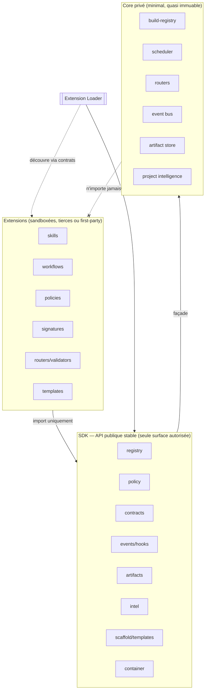
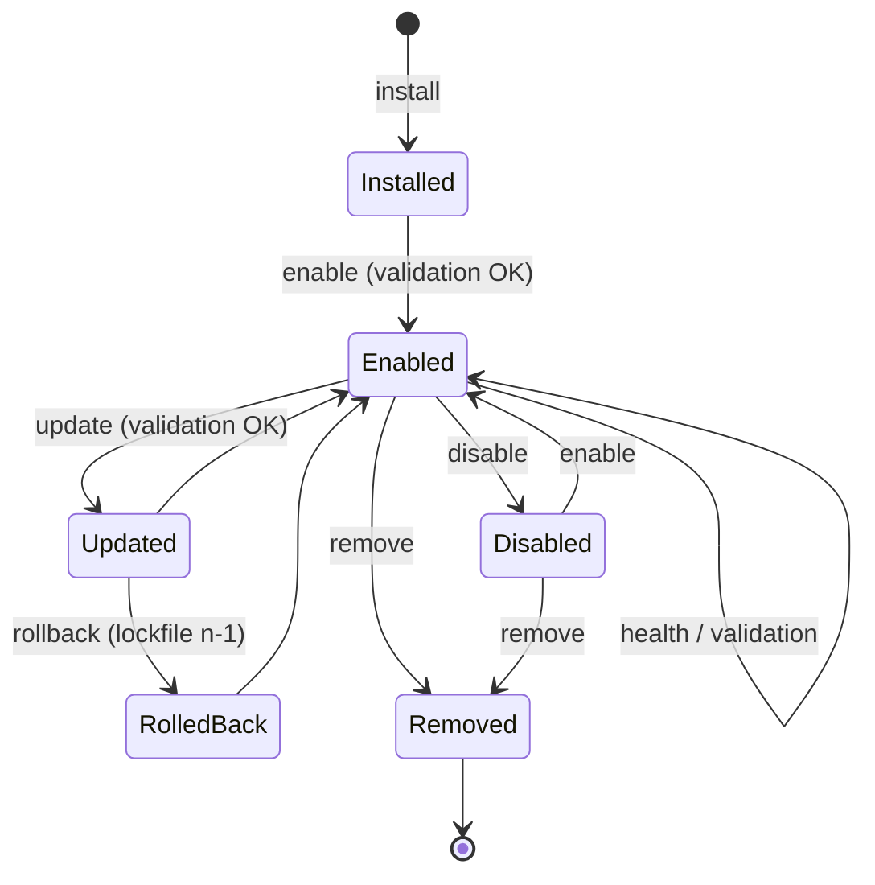
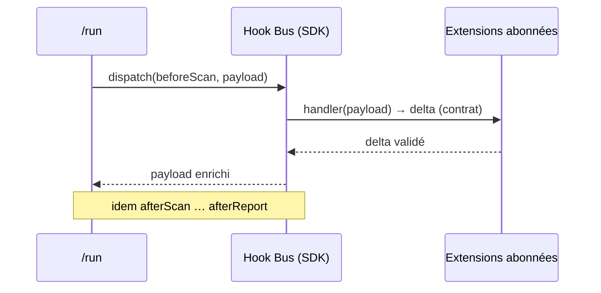

# dev-crew — Phase 5 : Ecosystem & SDK (SDS / ADR)

> **Statut : PROPOSÉ — en attente de validation.** Aucun fichier d'implémentation Phase 5
> avant validation (§ Auto-validation, puis accord).
>
> **Contraintes.** Le cœur ne connaît **jamais** une extension. Tout passe par des **contrats**.
> Le **SDK est la seule API publique**. Extensions **isolées**. Évolutions **additives**,
> **aucun breaking change**, **API v1 gelée**. Manifests validés par **JSON Schema**. Hooks
> documentés. Tout **testable** et **déterministe**.
>
> **Pas de logique métier ajoutée.** Objectif : transformer le framework en **plateforme
> extensible** ; le cœur devient minimal et quasi immuable.

---

## 0. Sommaire
1. Objectif & principe directeur
2. Architecture en couches (dépendances vers l'intérieur)
3. ADR-051 — Plugin SDK
4. ADR-052 — Extension Manifest
5. ADR-053 — Extension Loader
6. ADR-054 — Dependency Resolver
7. ADR-055 — Plugin Lifecycle
8. ADR-056 — Hook System
9. ADR-057 — Service Container
10. ADR-058 — Public API
11. ADR-059 — Marketplace
12. ADR-060 — Template Engine
13. ADR-061 — Validation SDK
14. ADR-062 — Sandbox (logique)
15. ADR-063 — Feature Packs
16. ADR-064 — SDK Generators
17. ADR-065 — Ecosystem Governance
18. Contrats & schémas (nouveaux, additifs ; v1 gelé)
19. Public API — surface stable
20. Arborescence cible
21. Conventions (deltas)
22. Migration Phase 4 → 5 & compatibilité
23. Stratégies (SDK / Extensions / Marketplace)
24. Auto-validation (preuves de cohérence)
25. Risques, hypothèses, questions ouvertes

---

## 1. Objectif & principe directeur

Tout ce qui est aujourd'hui dans le dépôt (skills, workflows, policies, signatures,
commands, agents, routers, validators, templates) doit pouvoir être **ajouté ou remplacé
par une extension**, sans toucher le cœur. Après la Phase 5, toute nouvelle fonctionnalité
= une extension via le SDK (Phase 6).

**Trois lois.**
1. **Direction des dépendances** : `Extensions → SDK public → Core privé`. Jamais l'inverse.
   Le cœur n'importe aucune extension ; le seul point de contact est le **Loader**.
2. **Contrats uniquement** : extensions et cœur ne communiquent que par contrats JSON
   versionnés (SDK API + schémas). Aucun accès aux internes.
3. **Additif & gelé** : API v1 d'orchestration gelée ; le SDK est une **nouvelle** surface
   versionnée (`sdkApiVersion`) ; tout ajout est optionnel et non cassant.

---

## 2. Architecture en couches



Le **Loader** est le seul composant qui « voit » les extensions ; il les enregistre auprès
du SDK (registry/policy/hooks/container). Le cœur ne référence que le SDK.

---

## 3. ADR-051 — Plugin SDK

**Contexte.** Besoin d'une surface stable pour créer skills, workflows, policies, signatures,
commands, agents, validators, routers, templates **sans modifier le framework**.

**Décision.** Un **SDK** (`sdk/`, paquet Node ESM) exposant des **interfaces stables** +
les **contrats publics** (schemas). Il définit :
- des **façades** typées par contrat (`registry`, `policy`, `contracts`, `events/hooks`,
  `artifacts`, `intel`, `templates`, `container`) — ADR-058 ;
- des **points d'extension** : `defineSkill`, `defineWorkflow`, `definePolicy`,
  `defineSignature`, `defineCommand`, `defineAgent`, `defineValidator`, `defineRouter`,
  `defineTemplate`, `registerHook`, `provideService`.
Chaque `define*` produit/valide un **artefact déclaratif** conforme à son schéma (le SDK
n'introduit pas de logique métier — il **cadre** et **valide** la déclaration).

**Plan.** tooling (façade déterministe) + schemas ; zéro IA.

**Conséquences.** (+) Extension écrite contre une API stable, indépendante des internes.
(−) Surface publique à maintenir compatible (versionnée `sdkApiVersion`, gouvernance ADR-065).

**Alternatives rejetées.** Laisser les extensions importer `tools/*` directement → couplage
au cœur, breaking à chaque refactor interne.

---

## 4. ADR-052 — Extension Manifest

**Décision.** Chaque extension porte `extension.json` (schéma `sdk/extension-manifest`).
Champs : `name, version, sdk (range compatible), author, license, dependencies[],
capabilities[], provides { skills, commands, workflows, templates, policies, signatures,
routers, validators, agents }, hooks[], assets[], permissions[]`. **Versionné** (SemVer) +
`sdkApiVersion`. `permissions[]` déclare ce que l'extension touche (base du Sandbox, ADR-062).

**Conséquences.** (+) Découverte et validation déterministes, capacités déclarées.
(−) Discipline de remplissage → généré par `new-extension` (ADR-064) + validé (ADR-061).

---

## 5. ADR-053 — Extension Loader

**Décision.** `tools/sdk/loader.mjs` **découvre automatiquement** les extensions depuis
plusieurs **sources** : `extensions/` (filesystem local), plugins marketplace, dépôts `git`,
paquets `npm`, `marketplace/` (index), sources `private`. Pour chaque source : lire
`extension.json` → valider (ADR-061) → résoudre les dépendances (ADR-054) → enregistrer via
le SDK (registry/policy/signatures/hooks/container). **Le cœur ne connaît aucune extension** :
le Loader est le seul pont, piloté par contrats. Résultat = un **lockfile** (ADR-054).

**Plan.** tooling déterministe ; sources déclaratives (`policies/marketplace.yaml`).

**Conséquences.** (+) Ajout d'extension = déposer/déclarer une source, jamais éditer le cœur
(OCP). (−) Ordre de chargement déterministe requis (par dépendances + priorité).

---

## 6. ADR-054 — Dependency Resolver

**Décision.** `tools/sdk/resolve-deps.mjs` résout `versions, contraintes, conflits,
priorités, compatibilité (sdk range), extensions transitives`. Algorithme déterministe :
tri topologique du graphe de dépendances, sélection de version par plage SemVer (highest
compatible), détection de conflit (deux plages incompatibles → erreur explicite). Produit un
**lockfile** `{ resolved: [{name, version, source, sdk}], order[] }` (schéma dédié).

**Conséquences.** (+) Chargement reproductible, conflits détectés tôt. (−) Pas de résolution
réseau dans le slice (offline-first) ; sources distantes = extension du resolver.

---

## 7. ADR-055 — Plugin Lifecycle

**Décision.** États et transitions documentés, pilotés par `tools/sdk/lifecycle.mjs` +
lockfile : `install → enable ⇄ disable → update → (rollback) → remove`, plus `health` et
`validation` transverses.



Chaque transition : entrées, garde (validation/compat), effet sur le lockfile, rollback.

**Conséquences.** (+) Cycle de vie prévisible, réversible. (−) État persistant (lockfile) à
protéger (versionné, hash).

---

## 8. ADR-056 — Hook System

**Décision.** Système d'événements de cycle **nommés** ; les extensions s'abonnent via
`registerHook(name, handler)`. Hooks : `beforeScan, afterScan, beforeWorkflow, afterWorkflow,
beforeSpecialist, afterSpecialist, beforeMerge, afterMerge, beforeReport, afterReport`
(extensible). Chaque hook a un **contrat de payload** (`schemas/sdk/hooks/<name>.schema.json`)
et est **déterministe** : dispatch ordonné (par priorité d'extension), **pur** (le handler
renvoie un delta contractuel, ne mute pas l'état global). Aucun hook enregistré ⇒ no-op.



**Conséquences.** (+) Extensions injectent du comportement aux points clés **sans toucher le
cœur**. (−) Handlers doivent rester purs/bornés (timeout, validation du delta).

---

## 9. ADR-057 — Service Container

**Décision.** Conteneur d'injection `tools/sdk/container.mjs` : les composants (routers,
validators, scheduler, stores) sont **résolus via le conteneur**, plus par `new`/import direct.
Une extension peut `provideService(id, impl)` pour **remplacer** une implémentation (ex. un
model-router alternatif), tant que l'impl respecte le contrat du service (`service-descriptor`).
Résolution déterministe : dernière liaison compatible gagne, priorité par policy.

**Conséquences.** (+) Remplaçabilité totale (LSP/DIP), cœur découplé des implémentations.
(−) Indirection ; les liaisons doivent être validées contre le contrat de service.

---

## 10. ADR-058 — Public API

**Décision.** Surface **publique unique** = le SDK (§19). Tout le reste (`tools/*` internes)
est **privé**. Règles : les extensions **n'importent que** `sdk/` ; l'accès aux internes est
**interdit** (convention + lint `no-core-import` dans la Validation SDK + Sandbox). L'API est
**versionnée** `sdkApiVersion` (indépendante de l'API v1 d'orchestration) ; un changement
incompatible crée `sdk/v2` en parallèle (gouvernance ADR-065).

**Conséquences.** (+) Le cœur peut être refactoré sans casser les extensions. (−) Nécessite de
figer et documenter la surface (contrat de compatibilité).

---

## 11. ADR-059 — Marketplace

**Décision.** Protocole de marketplace documenté, supportant sources `local, git, github,
registry, offline, private`. Un **index** (`marketplace-index`) liste des extensions
`{ name, version, source, checksum, sdk }`. `tools/sdk/marketplace.mjs` : `list/fetch/verify`.
Vérification d'intégrité par `checksum` (et signature, ADR-065). Offline-first : une source
`local`/`offline` fonctionne sans réseau.

**Conséquences.** (+) Distribution ouverte et vérifiable. (−) Sources distantes = accès réseau
(gated, hors slice déterministe local).

---

## 12. ADR-060 — Template Engine

**Décision.** Moteur de templates déterministe `tools/sdk/templates.mjs` ; **tous** les
générateurs l'utilisent. Support de cibles : `Markdown, JSON, YAML, TypeScript, JavaScript,
Prompt, Documentation`. Template = fichier + descripteur (`template-descriptor` : variables,
cible, post-hooks). Substitution pure (`{{var}}`), pas d'exécution arbitraire.

**Conséquences.** (+) Génération cohérente et testable (mêmes variables → même sortie).
(−) Migrer les templates inline (scaffold Phase 2) vers descripteurs.

---

## 13. ADR-061 — Validation SDK

**Décision.** `tools/sdk/validate-extension.mjs` vérifie une extension **avant chargement** :
`manifest` (schéma), `contrats` (les artefacts déclarés valident leurs schémas), `compatibilité`
(sdk range, api v1), `hooks` (noms connus + payloads conformes), `schemas` (fournis valides),
`capabilities` (résolvables/non conflictuelles), `version` (SemVer). Refuse le chargement en
cas d'échec (émet un `ExtensionValidationReport`). Intégré au Loader et à `selfcheck`.

**Conséquences.** (+) Sécurité d'écosystème, échec tôt. (−) Couverture des règles = qualité de
la validation (tests de fixtures d'extensions valides/invalides).

---

## 14. ADR-062 — Sandbox (logique)

**Contexte.** Une extension ne doit pas : modifier les contrats, casser le cœur, accéder aux
composants privés, contourner les policies.

**Décision.** Sandbox **logique/contractuelle** (le runtime plugin n'offre pas d'isolation OS) :
1. **Permissions déclarées** (`manifest.permissions[]`, schéma `capability-grant`) — l'extension
   ne peut agir que dans son périmètre déclaré ; le Loader refuse toute action hors périmètre.
2. **Écritures interdites** vers les dossiers du cœur et les contrats (`schemas/api/*` v1
   immuables) — vérifié par la Validation SDK + convention `no-core-write`.
3. **Précédence policies** : une extension ne peut **pas** relâcher `policies/security.yaml`
   (`denyExtensionOverride`, déjà ADR-034) ni surcharger un contrat v1.
4. **Accès privé interdit** : import de `tools/*` internes rejeté (lint `no-core-import`).

> Limite honnête : isolation **contractuelle**, pas un bac à sable OS. Une isolation
> process/`vm` est une **extension optionnelle** future (gated), contrat identique.

**Conséquences.** (+) Garanties d'isolation vérifiables statiquement. (−) Repose sur la
validation + la convention, pas sur une barrière runtime absolue.

---

## 15. ADR-063 — Feature Packs

**Décision.** Un **Feature Pack** = extension « grossière » regroupant `skills, knowledge,
templates, policies, signatures, workflows` sous un seul `extension.json` (`kind: "pack"`).
Découverte **automatique** par le Loader, comme toute extension. Permet de livrer un domaine
complet (ex. « pack e-commerce ») en un dépôt.

**Conséquences.** (+) Distribution par domaine, cohérente. (−) Granularité de version au niveau
pack (dépréciation groupée).

---

## 16. ADR-064 — SDK Generators

**Décision.** Générateurs **tous fondés sur le SDK + Template Engine** : `new-extension,
new-skill, new-workflow, new-policy, new-signature, new-router, new-template`. `new-extension`
scaffolde un `extension.json` valide + structure + tests + README. Les générateurs Phase 2/4
(`scaffold.mjs`) sont **réexprimés** au-dessus du Template Engine (mêmes sorties, source unique).

**Conséquences.** (+) Onboarding d'extension en une commande, conforme par construction.
(−) Convergence des anciens scaffolders vers le moteur commun (migration additive).

---

## 17. ADR-065 — Ecosystem Governance

**Décision.** Règles pour une évolution pluriannuelle, déclarées dans `policies/governance.yaml`
+ `docs/GOVERNANCE.md` :
- **Versionnement** : SemVer par extension + `sdkApiVersion` ; API v1 orchestration **gelée**.
- **Compatibilité / dépréciation** : fenêtre ≥ N versions mineures avant retrait ;
  `maturityLevel: deprecated` d'abord.
- **Migration** : guides + convertisseurs (comme phases précédentes).
- **Qualité / review** : Validation SDK + quality gates + audit `/review` avant publication.
- **Signature / provenance** : `checksum` obligatoire, **signature** cryptographique optionnelle
  vérifiée par la Marketplace.
- **Publication / rollback** : protocole marketplace + rollback via lockfile n-1.

**Conséquences.** (+) Écosystème durable et gouverné. (−) Processus à outiller (partiellement
policy, partiellement doc).

---

## 18. Contrats & schémas (nouveaux, additifs ; v1 gelé)

### 18.1 Nouveaux schémas (`schemas/sdk/`)
```
extension-manifest.schema.json      capability-grant.schema.json
service-descriptor.schema.json      lockfile.schema.json
marketplace-index.schema.json       marketplace-source.schema.json
template-descriptor.schema.json     extension-validation-report.schema.json
hook-registration.schema.json       hooks/<name>.schema.json (10 hooks)
public-api.schema.json (surface + sdkApiVersion)
```
Nouvelle famille versionnée `sdkApiVersion: "1.0.0"`, **indépendante** de l'API v1.

### 18.2 Deltas additifs (restent v1)
- `plan` / `task-input` : **aucun changement requis** (les hooks enrichissent hors contrat v1).
- `event` enum : ajout additif `ExtensionLoaded, HookDispatched` (non cassant).

### 18.3 extension.json (extrait)
```json
{
  "$schema": "../schemas/sdk/extension-manifest.schema.json",
  "name": "acme-ecommerce-pack", "version": "1.0.0", "kind": "pack",
  "sdk": ">=1.0.0 <2.0.0", "sdkApiVersion": "1.0.0",
  "author": "acme", "license": "MIT",
  "dependencies": [{ "name": "acme-payments", "range": ">=1.2.0 <2.0.0" }],
  "capabilities": ["checkout", "cart"],
  "provides": { "skills": ["skills/checkout"], "workflows": ["workflows/order.yaml"],
                "signatures": ["signatures/stripe.yaml"], "policies": [], "templates": [] },
  "hooks": [{ "name": "afterScan", "handler": "hooks/afterScan.mjs", "priority": 50 }],
  "permissions": ["read:registry", "register:skill", "register:hook"],
  "assets": []
}
```

### 18.4 service-descriptor (extrait)
```json
{ "id": "model-router", "contract": "schemas/api/model-decision.schema.json",
  "impl": "routers/my-router.mjs", "priority": 60 }
```

### 18.5 lockfile (extrait)
```json
{ "sdkApiVersion":"1.0.0","resolved":[{"name":"acme-ecommerce-pack","version":"1.0.0",
  "source":"local","sdk":">=1.0.0 <2.0.0","checksum":"sha256:…"}], "order":["acme-ecommerce-pack"] }
```

---

## 19. Public API — surface stable (`sdk/index.mjs`)

Seuls ces namespaces/fonctions sont publics (`sdkApiVersion: 1.0.0`) :

| Namespace | Fonctions (stables) |
|-----------|---------------------|
| `registry` | `getSkills, resolveCapability` (lecture seule) |
| `policy` | `get` (résolution ; **pas** d'écriture des policies cœur) |
| `contracts` | `validate(payload, contractId)` |
| `events` | `emit`, `on` (bus append-only) |
| `hooks` | `registerHook`, `dispatch` |
| `artifacts` | `put, get, list` |
| `intel` | `getProfile` (lecture) |
| `templates` | `render(templateId, vars)` |
| `container` | `provideService, resolveService` |
| `define*` | `defineSkill/Workflow/Policy/Signature/Command/Agent/Validator/Router/Template` |

Interdits publics : accès direct à `tools/*` internes, écriture des `schemas/api/*` v1,
mutation d'état global. Vérifiés par la Validation SDK (`no-core-import`, `no-core-write`).

---

## 20. Arborescence cible (ajouts sur Phase 4)

```
framework/
├── sdk/
│   ├── index.mjs                 # API publique (façade, versionnée sdkApiVersion)
│   ├── loader.mjs · resolve-deps.mjs · lifecycle.mjs · container.mjs · hooks.mjs
│   ├── templates.mjs · validate-extension.mjs · marketplace.mjs
│   ├── generators/ (new-extension, new-skill, …)
│   ├── templates/ (descripteurs md/json/yaml/ts/js/prompt)
│   ├── examples/ (extension d'exemple)
│   └── README.md
├── extensions/                   # extensions locales découvertes (déjà présent, formalisé)
├── marketplace/                  # index de sources + README
├── schemas/sdk/                  # manifest, hooks, service, lockfile, marketplace, template, validation
├── policies/                     # + marketplace.yaml · governance.yaml
├── commands/                     # + ext (install/enable/disable/update/remove/health) · new-extension
├── docs/                         # + PHASE5-ECOSYSTEM-SDK · PUBLIC-API · HOOKS · GOVERNANCE · MARKETPLACE
└── extensions.lock.json          # lockfile (résolution reproductible)
```

Le **cœur** (`tools/*` non-`sdk`) devient **privé** ; sa taille cesse de croître (nouvelles
capacités = extensions).

---

## 21. Conventions (deltas)

- **Un seul point d'entrée public** : les extensions importent **uniquement** `sdk/`.
- **Direction des dépendances** : jamais `core → extension`. Vérifié (`no-core-import`).
- **Manifests validés** : toute extension a un `extension.json` conforme (JSON Schema).
- **Hooks purs & documentés** : handler = fonction déterministe renvoyant un delta contractuel ;
  chaque hook a un schéma de payload et une entrée dans `docs/HOOKS.md`.
- **Permissions déclarées** : aucune action hors `manifest.permissions[]`.
- **Additif** : nouvelle capacité = extension ; le cœur n'est pas modifié.
- **SDK versionné** : `sdkApiVersion` séparé ; breaking ⇒ `sdk/v2`, jamais toucher v1.

---

## 22. Migration Phase 4 → 5 & compatibilité

**100 % additive.**
1. Introduire `sdk/` comme **façade** au-dessus des tools existants (aucune réécriture du cœur ;
   le SDK délègue). Publier `sdkApiVersion 1.0.0`.
2. Ajouter Loader + `extension.json` schema + Validation SDK + Hook System (**no-op** si aucun
   hook), Service Container (**opt-in** ; le cœur fonctionne sans injection au départ).
3. Insérer les points de hook aux étapes du pipeline (`beforeScan…afterReport`) — sans hook
   enregistré, comportement **identique** à Phase 4.
4. Reformuler progressivement les composants first-party en **extensions/packs** découverts par
   le Loader (le cœur se réduit) — **sans rien supprimer** tant que la parité n'est pas prouvée.
5. Générateurs Phase 2/4 réexprimés sur le Template Engine (mêmes sorties).

**Compatibilité.**
- **API v1 gelée** : aucun schéma `api/*` v1 modifié ; hooks/SDK sont hors de cette famille.
- **SDK** versionné indépendamment ; **contrats intel** (Phase 4) inchangés.
- **Rollback** : désactiver le Loader (flag `extensions`) ⇒ comportement Phase 4 strict.
  Lockfile n-1 pour revenir à un état d'extensions antérieur.
- **Event enum** étendu additivement (`ExtensionLoaded`, `HookDispatched`).

---

## 23. Stratégies

### SDK
Façade mince + contrats. Le SDK **ne contient pas** de logique métier : il **cadre** et
**valide** des déclarations et **délègue** au cœur. Stabilité garantie par gouvernance (ADR-065)
et tests de contrat de surface.

### Extensions
Auto-découvertes (Loader), validées (ADR-061), isolées (ADR-062), ordonnées (ADR-054), branchées
via hooks/container. Types : skill/workflow/policy/signature/command/agent/router/validator/
template, et **packs** (ADR-063).

### Marketplace
Protocole multi-source (local/git/github/registry/offline/private), index + checksum(+signature),
offline-first. Publication/rollback gouvernés.

---

## 24. Auto-validation (preuves de cohérence)

### 24.1 Couverture (ADR-051 → 065)
| ADR | Exigence | Réalisation | v1-safe |
|-----|----------|-------------|:---:|
| 051 | SDK créant tout type d'objet | `sdk/` + `define*` | ✅ |
| 052 | extension.json versionné | `extension-manifest.schema` | ✅ |
| 053 | Découverte multi-source, cœur ignorant | `loader.mjs` (seul pont) | ✅ |
| 054 | Résolution versions/conflits | `resolve-deps.mjs` + lockfile | ✅ |
| 055 | Cycle de vie complet | `lifecycle.mjs` + stateDiagram | ✅ |
| 056 | Hooks documentés | `hooks/*` + schémas + docs | ✅ additif |
| 057 | Injection, plus de `new` direct | `container.mjs` | ✅ opt-in |
| 058 | API publique unique, internes interdits | `sdk/index.mjs` + lints | ✅ |
| 059 | Marketplace multi-source | `marketplace.mjs` + protocole | ✅ |
| 060 | Générateurs par templates | `templates.mjs` | ✅ |
| 061 | Validation d'extension | `validate-extension.mjs` | ✅ |
| 062 | Isolation (contrats/privé/policies) | permissions + validation + garde-fous | ✅ |
| 063 | Feature packs auto-découverts | `kind: pack` + Loader | ✅ |
| 064 | Générateurs SDK | `sdk/generators/*` | ✅ |
| 065 | Gouvernance pluriannuelle | `governance.yaml` + docs | ✅ |

### 24.2 « Le cœur ne connaît jamais les extensions » (preuve)
Direction des dépendances **unidirectionnelle** (Extensions → SDK → Core). Le cœur n'importe
aucun chemin d'extension ; le **Loader** est l'unique bridge et opère **via contrats** (manifest,
services, hooks). Vérifiable statiquement : `no-core-import` (extensions), et le cœur ne référence
que `sdk/`.

### 24.3 Compatibilité v1 (preuve)
Aucun schéma `api/*` v1 modifié. SDK = **nouvelle** famille (`sdkApiVersion`). Hooks/services/
manifests sont additifs et optionnels. Loader désactivable (flag `extensions`) ⇒ Phase 4 stricte.
Test CI « no-breaking-v1 » inchangé + nouveau « no-breaking-sdk » (snapshot de la surface).

### 24.4 Invariants (contrôlés par Validation SDK / selfcheck / CI)
1. Une extension n'importe que `sdk/` (`no-core-import`).
2. Une extension n'écrit ni dans le cœur ni dans `schemas/api/*` v1 (`no-core-write`).
3. Tout `extension.json` et tout artefact fourni valident leurs schémas.
4. Une extension ne peut relâcher `policies/security.yaml`.
5. Aucune action hors `permissions[]` déclarées.
6. Hooks purs (delta contractuel), dispatch déterministe.
7. Surface SDK identique au snapshot (pas de breaking).

**Conclusion.** Exigences 051–065 couvertes, direction des dépendances prouvée, v1 + SDK
compatibilité garanties, isolation contractuelle vérifiable, déterminisme et testabilité tenus.
Design jugé **cohérent et prêt à implémenter** sous réserve des décisions ouvertes.

---

## 25. Risques, hypothèses, questions ouvertes

**Hypothèses.** `HYP-1` Node dispo. `HYP-2` isolation **contractuelle** acceptable pour le slice
(isolation OS = extension future). `HYP-3` sources distantes (git/npm/registry) = extensions du
Loader/Marketplace ; le slice reste **local/offline**.

**Risques.** Surface publique trop large (mitigée : API minimale + gouvernance) ; sandbox non-OS
(mitigée : validation stricte + permissions + interdiction d'écriture cœur) ; convergence des
anciens scaffolders (mitigée : migration additive, mêmes sorties).

**Questions ouvertes (décision avant code).**
- `Q1` — **Périmètre du slice** à implémenter après validation.
- `Q2` — **Modèle de sandbox** : contractuel/logique (recommandé, sans runtime) vs tentative
  d'isolation process/`vm`.
- `Q3` — **Extension de démonstration** pour prouver le SDK : un **Feature Pack** (skill +
  signature + workflow) vs une extension **router** (remplacement de service).

*Fin du document — en attente de validation interne et d'accord avant génération du Core SDK.*
