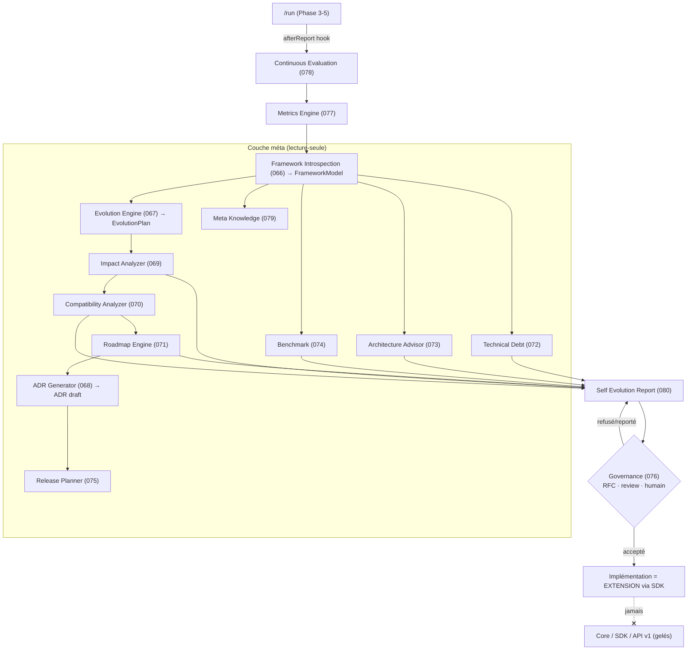
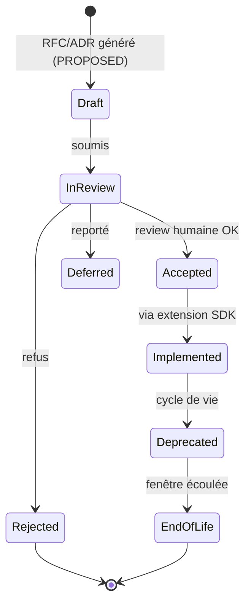

# dev-crew — Phase 6 : Meta-Framework (auto-évolution) (SDS / ADR)

> **Statut : PROPOSÉ — en attente de validation.** Aucun fichier d'implémentation Phase 6
> avant validation (§ Auto-validation, puis accord).
>
> **Contraintes absolues.** Le framework **ne modifie jamais son propre code**. La couche
> méta est **lecture-seule** : elle **propose**, elle n'applique pas. **Décisions humaines.**
> Analyses **déterministes** quand c'est possible ; les parties de **jugement** sont
> **explicitement identifiées**. **Aucune régression de compatibilité** : cœur **gelé**,
> SDK **gelé**, API v1 **gelée**.
>
> **Pas de nouvelle fonctionnalité utilisateur.** Objectif : ajouter la capacité d'**analyser,
> évaluer et planifier sa propre évolution**.

---

## 0. Sommaire
1. Objectif & principe directeur
2. Boucle d'auto-évolution (vue d'ensemble)
3. ADR-066 — Framework Introspection
4. ADR-067 — Evolution Engine
5. ADR-068 — ADR Generator
6. ADR-069 — Impact Analyzer
7. ADR-070 — Compatibility Analyzer
8. ADR-071 — Roadmap Engine
9. ADR-072 — Technical Debt Engine
10. ADR-073 — Architecture Advisor
11. ADR-074 — Benchmark Engine
12. ADR-075 — Release Planner
13. ADR-076 — Governance Engine
14. ADR-077 — Metrics Engine
15. ADR-078 — Continuous Evaluation
16. ADR-079 — Meta Knowledge
17. ADR-080 — Self Evolution Report
18. Placement : déterministe vs jugement
19. Contrats & schémas (famille méta, additive ; v1/SDK gelés)
20. Arborescence cible
21. Conventions (deltas)
22. Stratégies (évolution / gouvernance / compatibilité / migration)
23. Auto-validation (preuves de cohérence)
24. Risques, hypothèses, questions ouvertes

---

## 1. Objectif & principe directeur

Le framework devient **méta** : il se regarde lui-même comme un **projet analysable**
(réemploi de la couche Project Intelligence Phase 4 sur son propre dépôt), en tire un
**modèle**, en déduit **forces, faiblesses, dette, risques**, et **propose** des évolutions
avec **impact, compatibilité, migration, ROI**. Il n'exécute rien : il produit un **Self
Evolution Report** que des humains arbitrent (gouvernance). Les évolutions acceptées sont
implémentées **comme des extensions via le SDK** (Phase 5) — le cœur n'est jamais touché.

**Cinq lois.**
1. **Read-only** : la couche méta lit le dépôt et écrit **uniquement** des artefacts de
   proposition (`proposals/`, `artifacts/meta/`). Jamais de modification de code/contrat/policy.
2. **Proposition, pas action** : ADR/migrations/roadmaps sont des **brouillons** (statut
   `PROPOSED`) ; l'acceptation est **humaine** (Governance Engine).
3. **Déterministe-first** : structure, impact, compatibilité, dette, métriques = déterministes.
   Le **jugement** (recommandations, priorisation fine, narratif) est **marqué** et gated.
4. **Gelé** : aucune évolution proposée ne peut casser API v1 / SDK v1 ; un breaking est
   routé vers une **nouvelle famille** (`*/v2`), jamais un retrait de v1.
5. **Additive & flaggée** : toute la couche méta est derrière `features/flags.yaml → meta` ;
   désactivée ⇒ Phase 5 stricte.

---

## 2. Boucle d'auto-évolution



La méta **n'a qu'une flèche sortante réelle** : le rapport. Toute implémentation passe par
une **extension** (le cœur reste gelé).

---

## 3. ADR-066 — Framework Introspection

**Décision.** `tools/meta/introspect.mjs` construit un **FrameworkModel** : le framework vu
comme un projet. Réutilise `tools/intel/analyze.mjs` sur la racine + énumère et relie
**agents, skills, extensions, contracts, schemas, policies, SDK, workflows** (types +
arêtes : fournit/dépend/valide/référence). Agrège registry, depgraph, architecture-score,
rapports qualité. **Déterministe**, read-only. Sortie = artefact `framework-model`.

**Conséquences.** (+) Base commune de toutes les analyses méta (le framework se connaît
lui-même). (−) Modèle à maintenir avec les types d'artefacts (déjà couvert par depgraph).

---

## 4. ADR-067 — Evolution Engine

**Décision.** `tools/meta/evolution.mjs` : entrées **feedback, metrics, quality,
architecture-score, plugins, usage, bugs, roadmap** → **EvolutionPlan** (liste d'évolutions
proposées : titre, motivation, composants cibles, type, préconditions). **Ne code rien** :
planifie. Corrélation feedback→proposition = **déterministe** (règles/seuils policy) ;
la synthèse de feedback libre est **jugement** (gated, proposition seulement).

**Conséquences.** (+) Transforme des signaux hétérogènes en propositions traçables.
(−) Qualité = qualité des signaux → chaque proposition cite ses **preuves**.

---

## 5. ADR-068 — ADR Generator

**Décision.** `tools/meta/adr-gen.mjs` produit, pour une évolution, un **brouillon d'ADR**
(statut `PROPOSED`) via le Template Engine (Phase 5) : `contexte, problème, options, choix,
conséquences, migration, rollback`. Jamais accepté automatiquement (Governance ADR-076).
Sortie = artefact `adr-draft` + fichier `proposals/adr/ADR-XXX.draft.md`.

**Conséquences.** (+) Traçabilité systématique des décisions. (−) Le « choix » recommandé
est un **jugement marqué** ; l'humain tranche.

---

## 6. ADR-069 — Impact Analyzer

**Décision.** `tools/meta/impact.mjs` : pour une évolution (composants cibles), calcule via
le FrameworkModel (dépendances **inverses**) les **composants, contrats, extensions, SDK,
documentation, tests impactés** + **risque, coût, temps**. Structure = **déterministe** ;
coût/temps = estimations depuis `policies/metrics.yaml`. Sortie = `impact-report`.

**Conséquences.** (+) Aucune évolution proposée sans son périmètre d'impact. (−) Estimations
coût/temps calibrées (déclarées, versionnées).

---

## 7. ADR-070 — Compatibility Analyzer

**Décision.** `tools/meta/compat.mjs` **prouve** la compatibilité d'une évolution :
- `schemas/api/*` v1 **identiques** au snapshot (diff → si changé non-additif : **breaking**) ;
- surface **SDK** identique au snapshot (`no-breaking-sdk`) ;
- **extensions** : leurs contrats restent valides ; **schemas** : additifs seulement ;
- **policies/workflows/skills** : résolution inchangée (capacités toujours fournies).
Sortie = `compatibility-report { compatible, breaks[] }`. **Déterministe** (diff + résolution).
Un `break` route l'évolution vers `*/v2` (jamais toucher v1).

**Conséquences.** (+) Garantie « aucune régression » mécanisée. (−) Snapshots de référence à
maintenir (déjà prévus Phases 3/5).

---

## 8. ADR-071 — Roadmap Engine

**Décision.** `tools/meta/roadmap.mjs` : idées → **roadmap** priorisée. Score déterministe
par formule (`policies/evolution.yaml` : poids **ROI, risque, complexité, impact, coût**).
Sortie = `roadmap { items: [{ id, scores, priority, evidence }] }`. Départage à égalité et
arbitrages stratégiques = **jugement marqué**.

**Conséquences.** (+) Priorisation reproductible et explicable. (−) Poids à gouverner (policy).

---

## 9. ADR-072 — Technical Debt Engine

**Décision.** `tools/meta/techdebt.mjs` détecte **déterministiquement** :
- **duplication** (empreintes de contenu répétées), **couplage** (degré d'arêtes du graphe),
  **complexité** (taille/fan-in-out), **code mort** (modules non importés) ;
- **policies inutilisées** (clé jamais lue), **skills inutilisés** (capacités jamais requises
  par un workflow/plan), **knowledge inutilisée** (jamais sélectionnée par le Knowledge Router),
  **workflows inutilisés** (jamais lancés — usage/events), **extensions obsolètes**
  (`maturityLevel: deprecated` ou sdk hors plage).
Sortie = `tech-debt-report` (items + preuves + sévérité). Read-only.

**Conséquences.** (+) Dette objectivée, priorisable. (−) « Inutilisé » = absence de preuve
d'usage → fenêtre d'observation minimale avant de conclure.

---

## 10. ADR-073 — Architecture Advisor

**Décision.** `tools/meta/advisor.mjs` produit **forces, faiblesses, recommandations,
alternatives** à partir des scores + dette + modèle. **Ne modifie rien.** Les
recommandations sont un **jugement marqué**, chacune **justifiée par des preuves** ; le
narratif est gated (IA optionnelle). Sortie = `architecture-advice`.

**Conséquences.** (+) Conseil actionnable, traçable. (−) Nature consultative (proposition).

---

## 11. ADR-074 — Benchmark Engine

**Décision.** `tools/meta/benchmark.mjs` compare plusieurs architectures/options (ex.
courant vs proposé) sur **performances, maintenabilité, extensibilité, lisibilité,
complexité** — via métriques (ADR-077) et **proxies structurels déterministes** (couplage,
taille, couverture de contrats). Sortie = `benchmark-report` (tableau comparatif + gagnant
par dimension, sans décision imposée).

**Conséquences.** (+) Comparaison objective avant choix. (−) Proxies ≠ mesures runtime
complètes (déclarés comme tels).

---

## 12. ADR-075 — Release Planner

**Décision.** `tools/meta/release-planner.mjs` construit, à partir d'évolutions **acceptées**,
un plan : **release** (contenu, version SemVer), **migration** (étapes expand→contract),
**breaking changes** (routés `*/v2`), **rollback** (lockfile/versions n-1),
**communication** (changelog, notes). **Plan uniquement.** Sortie = `release-plan`.

**Conséquences.** (+) Release reproductible et sûre. (−) Exécution = humains + extensions.

---

## 13. ADR-076 — Governance Engine

**Décision.** Processus déclaratif (`policies/governance.yaml` + `docs/GOVERNANCE.md`) :
**RFC → ADR → validation → review → acceptation → dépréciation → fin de vie**. Machine à
états d'une proposition ; l'**acceptation est humaine**. `tools/meta/governance.mjs` suit
l'état (read-only ; met à jour un registre de propositions, pas le code).



**Conséquences.** (+) Évolution gouvernée sur des années. (−) Discipline de processus (outillée
partiellement, documentée).

---

## 14. ADR-077 — Metrics Engine

**Décision.** Métriques **communes** déclarées dans `policies/metrics.yaml` (définition, unité,
seuil, source). `tools/meta/metrics.mjs` calcule un `metrics-report` depuis events/traces
(observabilité Phase 3), registry, graphe, scores. **Toute évolution est mesurable** : une
proposition sans métrique de succès est signalée.

**Conséquences.** (+) Base quantitative unique et versionnée. (−) Certaines métriques runtime
= estimations (déclarées).

---

## 15. ADR-078 — Continuous Evaluation

**Décision.** Après **chaque exécution**, via le **hook `afterReport`** (Phase 5, **aucun
changement du cœur**), `tools/meta/evaluate.mjs` produit un `evaluation-report` : **ce qui a
bien fonctionné, ce qui a échoué, ce qui peut être amélioré**. Agrégation **déterministe**
(events, gates, coûts) ; narratif gated. Alimente l'Evolution Engine.

**Conséquences.** (+) Boucle d'apprentissage continue sans toucher le cœur (hook). (−) Volume
d'évaluations → rétention (policy).

---

## 16. ADR-079 — Meta Knowledge

**Décision.** Base de connaissances **sur le framework lui-même** : `meta/knowledge/` +
**why-index** (`concept/composant → ADR + rationale`). `tools/meta/meta-knowledge.mjs` répond
à « **Pourquoi cette architecture / policy / workflow / extension ?** » par **lookup
déterministe** dans les ADR + manifestes (chaque skill/policy/extension référence son ADR/
rationale). Reformulation en langage naturel = gated. Read-only.

**Conséquences.** (+) Décisions explicables et interrogeables. (−) Qualité = liage
ADR↔composant (convention : chaque composant cite son ADR).

---

## 17. ADR-080 — Self Evolution Report

**Décision.** `tools/meta/self-evolution-report.mjs` agrège **un rapport unique** :
architecture, dette, risques, compatibilité, roadmap, priorités, propositions, migrations,
impact. Sortie = artefact `self-evolution-report` + `proposals/self-evolution/<date>.md`.
**Document principal** pour faire évoluer la plateforme, soumis à la Gouvernance.

**Conséquences.** (+) Point d'entrée unique de l'évolution. (−) Cohérence = cohérence des
contrats amont (garantie par le Contract Engine).

---

## 18. Placement : déterministe vs jugement

| Composant | Déterministe | Jugement (marqué, gated, proposition) |
|-----------|:---:|:---:|
| Introspection / FrameworkModel | ✅ | — |
| Impact / Compatibility | ✅ | — |
| Technical Debt / Metrics | ✅ | — |
| Benchmark (proxies) | ✅ | pondération finale |
| Roadmap (scores) | ✅ | départage stratégique |
| Evolution Engine | ✅ (règles) | synthèse de feedback libre |
| Architecture Advisor | preuves ✅ | recommandations/narratif |
| ADR Generator | structure ✅ | « choix » recommandé |
| Continuous Evaluation | agrégats ✅ | narratif |
| Meta Knowledge | lookup ✅ | reformulation NL |
| Governance / Acceptation | état ✅ | **décision = humaine** |

Règle : **par défaut, aucune IA.** Le jugement est **signalé** dans chaque artefact
(`judgment: true` + preuves) et **désactivable**. Aucune décision automatique.

---

## 19. Contrats & schémas (famille méta, additive ; v1/SDK gelés)

### 19.1 Nouveaux schémas (`schemas/meta/`, `metaApiVersion: 1.0.0`)
```
framework-model.schema.json        evolution-plan.schema.json
adr-draft.schema.json              impact-report.schema.json
compatibility-report.schema.json   roadmap.schema.json
tech-debt-report.schema.json       architecture-advice.schema.json
benchmark-report.schema.json       release-plan.schema.json
metrics-definition.schema.json     metrics-report.schema.json
evaluation-report.schema.json      meta-knowledge.schema.json
self-evolution-report.schema.json  rfc.schema.json
```
Famille **indépendante** — n'affecte ni l'API v1 ni le SDK v1.

### 19.2 Deltas additifs (restent v1)
- **Aucun** changement des schémas `api/*` v1 ni de la surface SDK.
- **Event enum** : ajout additif `EvaluationProduced` (émis par le hook `afterReport`).
- Convention additive : chaque `skill.json`/`extension.json`/policy peut porter `adr: "ADR-0xx"`
  (champ optionnel) pour le Meta Knowledge (why-index).

### 19.3 EvolutionPlan (extrait)
```json
{ "metaApiVersion":"1.0.0","generatedAt":"…",
  "items":[{ "id":"evo-001","title":"Extraire model-router en extension",
    "motivation":"réduire le couplage cœur","targets":["tools/model-router.mjs"],
    "type":"refactor","evidence":["coupling=high","architecture-score.Complexity=71"],
    "judgment":false }] }
```

### 19.4 CompatibilityReport (extrait)
```json
{ "metaApiVersion":"1.0.0","evolution":"evo-001","compatible":true,
  "checks":{"apiV1":"unchanged","sdk":"unchanged","schemas":"additive-only",
            "capabilities":"all-provided"},"breaks":[] }
```

### 19.5 self-evolution-report (structure)
`{ metaApiVersion, generatedAt, architecture, techDebt, risks, compatibility, roadmap,
   priorities, proposals[], migrations[], impact }`.

---

## 20. Arborescence cible (ajouts sur Phase 5)

```
framework/
├── tools/meta/            introspect · evolution · adr-gen · impact · compat · roadmap
│                          · techdebt · advisor · benchmark · release-planner · metrics
│                          · evaluate · meta-knowledge · self-evolution-report · governance (.mjs)
├── schemas/meta/          16 schémas (metaApiVersion 1.0.0)
├── policies/              + governance.yaml · metrics.yaml · evolution.yaml
├── meta/knowledge/        why-index (concept/composant → ADR + rationale)
├── proposals/             (git-ignoré sauf README) adr/ · migrations/ · self-evolution/
├── artifacts/meta/        rapports méta (git-ignoré)
├── commands/              + evolve (self-evolution-report) · self-eval · why
└── docs/                  + PHASE6-META-FRAMEWORK · GOVERNANCE · METRICS
```

Le **cœur (`tools/*` non-meta, `sdk/`) et les contrats v1** ne sont **pas** modifiés. La
couche méta est **read-only** et **additive**.

---

## 21. Conventions (deltas)

- **Read-only méta** : les outils `tools/meta/*` **ne peuvent pas écrire** hors de
  `proposals/` et `artifacts/meta/`. Vérifié (`no-core-write` étendu au méta).
- **Proposition, jamais action** : sortie = artefacts (statut `PROPOSED`), aucune édition
  de code/contrat/policy.
- **Jugement signalé** : tout artefact marque ses parties de jugement (`judgment: true`) +
  fournit les **preuves** déterministes.
- **Traçabilité ADR** : chaque composant peut référencer son `adr:` (why-index).
- **Compatibilité prouvée** : une proposition sans `compatibility-report.compatible=true`
  (ou routée `*/v2`) ne peut pas être recommandée pour acceptation.
- **Décision humaine** : la Gouvernance ne s'auto-accepte jamais.
- **Additif & gelé** : famille `metaApiVersion` séparée ; v1/SDK intouchés.

---

## 22. Stratégies

### Évolution
Signaux (metrics/quality/feedback/usage/bugs) → **EvolutionPlan** → **Impact** + **Compatibility**
→ **Roadmap** priorisée → **ADR draft** + **Release/Migration plan** → **Self Evolution Report**
→ Gouvernance (humain) → **extension SDK**. Le cœur ne bouge pas.

### Gouvernance
RFC/ADR versionnés ; états `Draft→InReview→Accepted/Rejected/Deferred→Implemented→Deprecated→EOL`.
Acceptation humaine ; dépréciation à fenêtre ; provenance (Phase 5).

### Compatibilité
Preuve mécanique (snapshots API v1 + SDK, additivité des schémas, résolution des capacités).
Tout breaking ⇒ **nouvelle famille `*/v2`**, jamais retrait de v1. Tests CI `no-breaking-v1`,
`no-breaking-sdk`, `no-breaking-meta`.

### Migration
Plans **expand → migrate → contract** générés (ADR-075), **jamais appliqués** par la méta ;
appliqués par extension/humain, réversibles (lockfile n-1).

---

## 23. Auto-validation (preuves de cohérence)

### 23.1 Couverture (ADR-066 → 080)
| ADR | Exigence | Réalisation | Read-only | v1/SDK-safe |
|-----|----------|-------------|:---:|:---:|
| 066 | Modèle du framework | `introspect.mjs` → FrameworkModel | ✅ | ✅ |
| 067 | Evolution Engine (planifie, ne code pas) | `evolution.mjs` → EvolutionPlan | ✅ | ✅ |
| 068 | ADR auto (draft) | `adr-gen.mjs` → adr-draft | ✅ | ✅ |
| 069 | Impact complet | `impact.mjs` → impact-report | ✅ | ✅ |
| 070 | Preuve de compatibilité | `compat.mjs` → compatibility-report | ✅ | ✅ |
| 071 | Roadmap priorisée (ROI/risque/…) | `roadmap.mjs` | ✅ | ✅ |
| 072 | Dette technique auto | `techdebt.mjs` | ✅ | ✅ |
| 073 | Advisor (ne modifie rien) | `advisor.mjs` | ✅ | ✅ |
| 074 | Benchmark d'architectures | `benchmark.mjs` | ✅ | ✅ |
| 075 | Release Planner | `release-planner.mjs` | ✅ | ✅ |
| 076 | Gouvernance (RFC→EOL) | `governance.yaml` + state machine | ✅ | ✅ |
| 077 | Métriques communes | `metrics.yaml` + `metrics.mjs` | ✅ | ✅ |
| 078 | Évaluation continue | hook `afterReport` + `evaluate.mjs` | ✅ | ✅ additif |
| 079 | Meta Knowledge (pourquoi ?) | why-index + `meta-knowledge.mjs` | ✅ | ✅ |
| 080 | Self Evolution Report unique | `self-evolution-report.mjs` | ✅ | ✅ |

### 23.2 « Ne modifie jamais son propre code » (preuve)
Les outils `tools/meta/*` **n'écrivent que** dans `proposals/` et `artifacts/meta/`
(convention `no-core-write` étendue, vérifiée par selfcheck/CI). Toutes les sorties sont des
**artefacts de proposition** ; l'implémentation passe par **extension SDK** décidée par un
humain. Le cœur, le SDK et les contrats v1 restent **byte-identiques** (snapshots).

### 23.3 Déterminisme & jugement
Structure/impact/compatibilité/dette/métriques = **déterministes** (mêmes entrées → mêmes
artefacts). Les parties de jugement sont **marquées** (`judgment: true`), **gated**,
**désactivables**, et toujours accompagnées de preuves déterministes.

### 23.4 Compatibilité (preuve)
Aucun schéma `api/*` v1 ni la surface SDK ne changent (famille `metaApiVersion` séparée).
Ajouts : event `EvaluationProduced` (additif) + champ optionnel `adr:` (ignoré par les
consommateurs existants). Couche entière derrière flag `meta` ⇒ désactivée = Phase 5 stricte.

### 23.5 Invariants (contrôlés par selfcheck / CI)
1. `tools/meta/*` n'écrivent pas hors `proposals/` et `artifacts/meta/`.
2. Aucune sortie méta n'édite code/contrat/policy.
3. Toute proposition recommandée porte un `compatibility-report.compatible=true` (ou `*/v2`).
4. Jugement toujours signalé + prouvé ; jamais de décision automatique.
5. Snapshots API v1 + SDK inchangés (`no-breaking-*`).
6. Déterminisme : re-run à dépôt constant ⇒ artefacts méta identiques.

**Conclusion.** Exigences 066–080 couvertes ; read-only et « propose seulement » prouvés ;
déterminisme + jugement délimités ; v1/SDK/API gelés et compatibilité mécanisée. Design jugé
**cohérent et prêt à implémenter** sous réserve des décisions ouvertes.

---

## 24. Risques, hypothèses, questions ouvertes

**Hypothèses.** `HYP-1` Node dispo. `HYP-2` la méta réutilise Project Intelligence (Phase 4)
sur le dépôt du framework (dogfooding). `HYP-3` « inutilisé » requiert une fenêtre
d'observation (events) avant conclusion — sinon marqué `low-confidence`.

**Risques.** Faux positifs de dette (mitigés : preuves + seuils + fenêtre) ; sur-confiance
dans les proxies de benchmark (mitigés : déclarés non-runtime) ; dérive du jugement (mitigée :
gating + décision humaine obligatoire).

**Questions ouvertes (décision avant code).**
- `Q1` — **Périmètre du slice** à implémenter après validation.
- `Q2` — **Évaluation continue** : branchée sur le hook `afterReport` (recommandé, zéro
  changement du cœur) vs outil lancé manuellement.
- `Q3` — **Jugement** : proposer **déterministe seulement** avec lacunes marquées (recommandé)
  vs activer le narratif IA (gated) dès le slice.

*Fin du document — en attente de validation interne et d'accord avant génération des
composants d'analyse et de gouvernance.*
