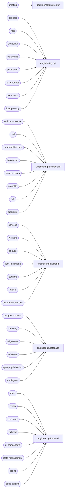

<!-- GÉNÉRÉ PAR tools/gen-docs.mjs — NE PAS ÉDITER À LA MAIN -->

# Graphe des capacités

```mermaid
flowchart LR
  c_greeting(["greeting"])
  c_greeting --> s_documentation_greeter["documentation.greeter"]
  c_openapi(["openapi"])
  c_openapi --> s_engineering_api["engineering.api"]
  c_rest(["rest"])
  c_rest --> s_engineering_api["engineering.api"]
  c_endpoints(["endpoints"])
  c_endpoints --> s_engineering_api["engineering.api"]
  c_versioning(["versioning"])
  c_versioning --> s_engineering_api["engineering.api"]
  c_pagination(["pagination"])
  c_pagination --> s_engineering_api["engineering.api"]
  c_error_format(["error-format"])
  c_error_format --> s_engineering_api["engineering.api"]
  c_webhooks(["webhooks"])
  c_webhooks --> s_engineering_api["engineering.api"]
  c_idempotency(["idempotency"])
  c_idempotency --> s_engineering_api["engineering.api"]
  c_architecture_style(["architecture-style"])
  c_architecture_style --> s_engineering_architecture["engineering.architecture"]
  c_ddd(["ddd"])
  c_ddd --> s_engineering_architecture["engineering.architecture"]
  c_clean_architecture(["clean-architecture"])
  c_clean_architecture --> s_engineering_architecture["engineering.architecture"]
  c_hexagonal(["hexagonal"])
  c_hexagonal --> s_engineering_architecture["engineering.architecture"]
  c_microservices(["microservices"])
  c_microservices --> s_engineering_architecture["engineering.architecture"]
  c_monolith(["monolith"])
  c_monolith --> s_engineering_architecture["engineering.architecture"]
  c_adr(["adr"])
  c_adr --> s_engineering_architecture["engineering.architecture"]
  c_diagrams(["diagrams"])
  c_diagrams --> s_engineering_architecture["engineering.architecture"]
  c_services(["services"])
  c_services --> s_engineering_backend["engineering.backend"]
  c_workers(["workers"])
  c_workers --> s_engineering_backend["engineering.backend"]
  c_queues(["queues"])
  c_queues --> s_engineering_backend["engineering.backend"]
  c_auth_integration(["auth-integration"])
  c_auth_integration --> s_engineering_backend["engineering.backend"]
  c_caching(["caching"])
  c_caching --> s_engineering_backend["engineering.backend"]
  c_logging(["logging"])
  c_logging --> s_engineering_backend["engineering.backend"]
  c_observability_hooks(["observability-hooks"])
  c_observability_hooks --> s_engineering_backend["engineering.backend"]
  c_postgres_schema(["postgres-schema"])
  c_postgres_schema --> s_engineering_database["engineering.database"]
  c_indexing(["indexing"])
  c_indexing --> s_engineering_database["engineering.database"]
  c_migrations(["migrations"])
  c_migrations --> s_engineering_database["engineering.database"]
  c_relations(["relations"])
  c_relations --> s_engineering_database["engineering.database"]
  c_query_optimization(["query-optimization"])
  c_query_optimization --> s_engineering_database["engineering.database"]
  c_er_diagram(["er-diagram"])
  c_er_diagram --> s_engineering_database["engineering.database"]
  c_react(["react"])
  c_react --> s_engineering_frontend["engineering.frontend"]
  c_nextjs(["nextjs"])
  c_nextjs --> s_engineering_frontend["engineering.frontend"]
  c_typescript(["typescript"])
  c_typescript --> s_engineering_frontend["engineering.frontend"]
  c_tailwind(["tailwind"])
  c_tailwind --> s_engineering_frontend["engineering.frontend"]
  c_ui_components(["ui-components"])
  c_ui_components --> s_engineering_frontend["engineering.frontend"]
  c_state_management(["state-management"])
  c_state_management --> s_engineering_frontend["engineering.frontend"]
  c_seo_fe(["seo-fe"])
  c_seo_fe --> s_engineering_frontend["engineering.frontend"]
  c_code_splitting(["code-splitting"])
  c_code_splitting --> s_engineering_frontend["engineering.frontend"]
```
