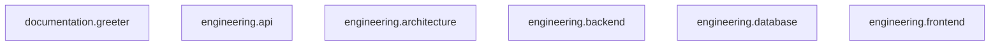

<!-- GÉNÉRÉ PAR tools/gen-docs.mjs — NE PAS ÉDITER À LA MAIN -->

# Graphe des dépendances (par capacité)

```mermaid
flowchart TD
  s_documentation_greeter["documentation.greeter"]
  s_engineering_api["engineering.api"]
  s_engineering_architecture["engineering.architecture"]
  s_engineering_backend["engineering.backend"]
  s_engineering_database["engineering.database"]
  s_engineering_frontend["engineering.frontend"]
```

> Les dépendances fines figurent dans chaque skill.json (`dependencies[].capability`).
